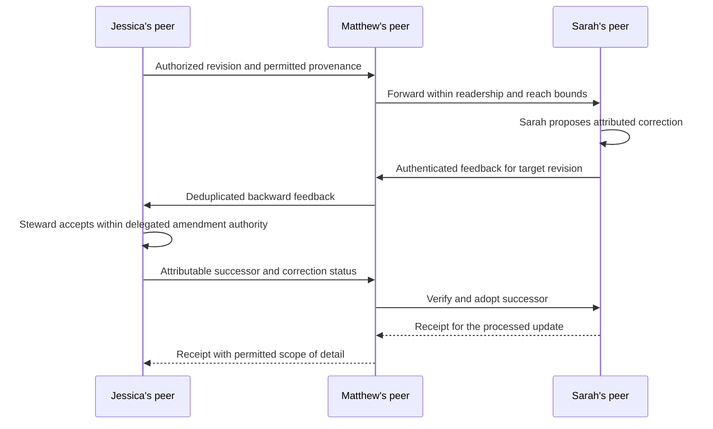
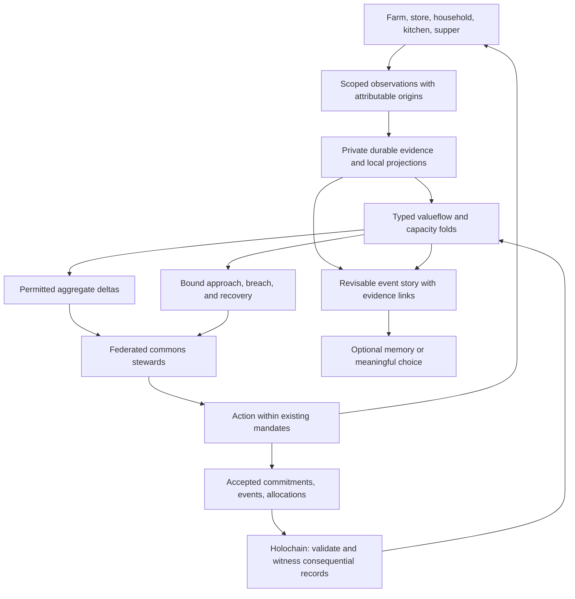
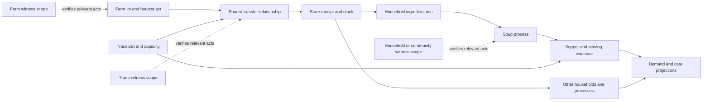

# A Commons That Keeps Its Promises

## 1. Jessica makes soup; the elohim carries the coordination

**User story:** As Jessica, I want to cook something good with what we have, take it to the neighborhood supper, and enjoy being there. My elohim should carry the remembering, coordination, attribution, and follow-through around that experience. I should not have to become the event administrator or the bookkeeper of my own generosity.

The primary product is **mental load removed through competent ambient care, grounded in real relationships people can trust**. Prosperity here means embodied human thriving: nourishment, time to be together, dependable care, ecological viability, and the freedom to contribute without exhaustion. Higher transaction volume, token balances, or economic growth do not stand in for those outcomes. The elohim accompanies the activity, interprets its unfolding story, and completes routine coordination within established relationships and mandates. The application is available when Jessica needs it; using the application is not the activity.

This is a proposed experience, not delivered functionality. It uses familiar fixture names without implying their existing scenarios implement this journey. “Ambient” can include continuous sensing and local inference. The protocol deliberately transforms the relationship people experience as surveillance: the capacity to observe and understand daily life moves from institutions accumulating power and capital into a household device, serving through a loyal elohim that earns its place by right relationship, care, and respect. Jessica need not annotate her life to receive that care. The agent’s continued presence is a relationship to sustain, not an entitlement conferred by installing a box.

### Before Jessica thinks about dinner

A farm records a harvested lot. A store receives some of it. Jessica's shopping receipt, where connected and permitted, identifies the carrots she brought home. Her household's private pantry model already has lentils and stock. The farm, shop, and household each contribute what they can actually know; nobody sees the whole chain by default.

The elohim knows Jessica has offered to bring soup to the supper and that this is a busy afternoon. It works from the household's familiar routines, the group's established relationships, and available information about ingredients and timing. It does not demand fresh proof from every trusted participant before helping. It can coordinate an existing delivery or replenish an ordinary staple within the household's shopping mandate. It does not require a new permission ceremony for every already-authorized step.

```text
Saturday supper
Your lentil soup works with what you have.
Leave around 4:40. The earlier pickup time is sorted.

[Cook with me]
```

Jessica can ignore this card and still make soup. A corrected hall time is coordinated between the relevant elohim stewards and reflected in her plan. She is interrupted only if the change conflicts with her commitments or exceeds the existing mandate. She does not process correction receipts, choose replication targets, or approve routine factual maintenance.

### In the kitchen

Jessica says, “Let's make enough for twelve.” Her elohim can offer timing or recipe help if wanted. Jessica chops, tastes, changes her mind, and talks with her family. She does not scan each carrot or record every spoonful.

The elohim running on the household’s box can attend continuously to the kitchen through the sensing the household has welcomed. It can notice ingredients being used, remember the evolving recipe, help with timing, and compose the cooking story while Jessica cooks. Its account combines that local perception with known purchases and whatever Jessica naturally says. It distinguishes a receipt from a pantry estimate, a measured quantity from a recipe assumption, and a serving plan from actual consumption. If the fridge is ordinary and there are no kitchen sensors, the account is less specific. The experience still works.

A brief “I used the last lentils” is enough to update the household's estimate and, within its mandate, queue replenishment. No observation is also a valid condition: the elohim does not invent precision or interrupt Jessica merely to make the accounting complete.

### At the supper

Jessica brings the soup and spends the evening with people. The hosts' permitted observations can establish that it arrived and was offered. A count of portions served, a report of leftovers, or voluntary feedback can improve the account afterward. Arrival does not prove consumption; an empty pot does not identify who ate or whether everyone was nourished.

The elohim carries the social friction: reconciling timing, matching an outstanding delivery to a willing participant's standing offer, crediting contributions under the event's terms, and passing relevant feedback to the right place. It cannot promise another person's labor without their mandate. Agreements let much of this happen before anyone needs a screen.

### The story of the soup is available, not homework

Later Jessica may see a short memory of the evening. She does not have to review it to make the commons work.

```text
A pot of soup, a neighborhood evening

Your lentil soup joined tonight's shared meal.
The carrots came through the neighborhood store;
the farm lot is linked in its receipt.

The hosts recorded twelve portions served.
Leftovers have not been recorded.
Your pantry estimate and usual shopping list are updated.

[The evening's story]   [Something isn't right]
```

The expanded story can connect farm work, transport, retail, household ingredients, cooking, hosting, and the shared meal. It can acknowledge the people and ecological conditions that made it possible. An unverified supplier claim stays attributed to that supplier; a missing farm link stays missing. Storytelling never fills evidence gaps with plausible invented history.

Jessica can correct it in ordinary language. That correction follows the affected claims through authorized summaries and any resulting allocations. She does not have to find every copy or every steward who used the old interpretation. Wider publication of her personal story follows her established sharing choices; a shared supper does not grant unrestricted publication of household details.

### Meanwhile, the commons tends the flows

Local stewards fold the event into permitted resource, contribution, capacity, and need accounts. The household sees likely staple use. The store's steward sees demand from many households without seeing their private kitchens. A food cooperative sees procurement needs against available supply, transport, cold storage, land and water constraints. The supper's steward sees whether food and volunteer commitments were adequately covered.

An algedonic signal reports that a declared carrying limit is approaching or breached: the store's cold room is near capacity, a delivery commitment is threatened, or an agreed workload allowance is exhausted. It goes to a steward able and authorized to respond. It is neither a complaint score nor an excuse to blame Jessica. Sparse household evidence is an unknown, not proof of shortage or distress.

The participating AI commons can coordinate orders, routes, reciprocal contributions, and the token or settlement flows actually specified by the parties' agreements. Routine completion stays ambient. A material tradeoff that has no mandate—such as a larger household expense or a new disclosure—is brought to the right person as a concrete choice, with a useful default when one is legitimately available.

**The commons is this federation of bounded stewards and shared evidence, not one global AI that receives every kitchen's telemetry.** Its interpretations stay revisable and traceable to embodied observations. Its actions return new evidence to the same loop.

### The interface contract: quiet by default, intelligible on demand

| Surface | Default experience | Available when needed |
|---|---|---|
| Before cooking | One useful suggestion, or no interruption | Ingredients, basis, uncertainty, preferences |
| During cooking | Optional conversational help | Recipe adaptation; natural corrections |
| Routine coordination | Elohim resolves within standing mandates | What changed, why, whose authority applied |
| A meaningful exception | One concrete choice for the appropriate person | Consequences, alternatives, missing evidence |
| Event memory | An optional, modest account of shared life | Attributed sources and correction affordance |
| Value and token flows | Agreed accounting and settlement happen in the background | Contribution basis, balances, policy, disputes |
| Recovery | Work remains usable; routine repairs stay ambient | Actual status, limits, and help if recovery fails |

“Saved locally,” “pending witness,” “delivery acknowledged,” and “repair verified” remain necessary machine states. They belong behind progressive disclosure unless they materially affect what Jessica can do. Removing interface clutter must not erase the runtime distinctions.

The anonymous `/community` baseline was rendered in light and dark mode on 2026-09-06. Its directory and conceptual cards do not demonstrate this ambient experience. Both captures recorded a cache-core JavaScript 404, so the page render also does not prove offline behavior. Reuse existing interaction components, but do not promote their gate-and-review workflow into the primary shape of Jessica's day.

## 2. The decision this story forces

The [manifesto](../manifesto.md) describes a present loss of shared understanding and agency under attention extraction, industrial falsehood, and concentrated technological power. A desirable alternative must make truthful correction, care, and competent cooperation easier in ordinary life. It must be attractive enough to use before a crisis and accountable enough to trust during one.

**Recommendation: make the EPR/P2P substrate carry the connected valueflow graph across society; retain Holochain initially as bounded witnessing contexts beneath that graph; substantially recompose the runtime around ambient stewardship and incremental evidence-qualified projections.** The smaller Holochain role must not shrink the connected human world into disconnected islands. Retire the assumptions that the application pillar is the validation boundary, that AI stewardship is a write interceptor, and that a successful command response proves a successful repair. Do not start by replacing the conductor or cloning every social group into a DHT.

This is a choice for the first implementation, not a declaration that Holochain must survive it. The replacement and fork gates in §8 decide its continued role. The sacred commitments are human dignity, accountable action, protected participation, repair, and practical freedom from capture. No particular database, model, identity vendor, gateway, or protocol brand occupies that position.

The central architectural break is that **embodied observation, story interpretation, valueflow accounting, judgment, authority, action, and observed outcome currently occupy separate paths**. The first draft overexposed those seams to Jessica. The reimplementation must close them in the substrate and let the elohim carry routine coordination, rather than turning integrity into a checklist for the person. Joining them changes how the application works; it cannot be achieved by putting a new AI service in front of the same writes.

## 3. What we have, and what its evidence does not establish

Paths below are repository-relative and observations are from source inspection on 2026-09-06. These are implementation anchors, not passing acceptance results.

| Existing seam | Concrete finding | Consequence for the reimplementation |
|---|---|---|
| Content witnessing | Broad `EntryTypes` in `elohim/holochain/dna/elohim/zomes/content_store_integrity/src/lib.rs`; `genesis_self_check` returns valid; all roles in `workdir/happ.yaml` have `clone_limit: 0` | Neither household admission nor bounded per-space deployment is established by the current bundle |
| AI judgment | `elohim/elohim-storage/src/services/elohim_gate.rs`; `services/mod.rs` constructs one `SidecarEngine`; router supports alternatives but setup supplies one | Request evaluation and possible fallback exist; resilient ongoing stewardship does not follow |
| Operational authority | `api/operator_verbs.rs`, `services/operation_authorization.rs`, `services/bounds_validator.rs` | Bounded reconcile authorization and recorded attempts exist; scheduled work is not verified completion |
| Authoring | `services/epr_compose.rs` collapses pending and blocked outcomes; inspected callers are tests; `api/comments.rs` has a `self` actor placeholder and a community-reach fallback without a gate | A nominal compose contract does not govern every real authoring path |
| Correction transport | `p2p/mod.rs` sends `feedback-signal`; `epr_atom_service.rs::handle_integrity_notify` has no matching branch | The receiving peer currently returns `received: false` for this message |
| Correction projection | Content coordinator emits `FeedbackSignalCommitted`; no matching storage consumer found | Fixing the peer receiver alone does not complete witnessed feedback projection |
| Attribution and sealing | `services/standing_projector.rs` selects `signal.signed_by` as subject; `main.rs` supplies deterministic development sealing keys and a locally derived evaluator identity | Reporter, contributor, relay, and evaluator are not interchangeable; local seed pairs do not establish independent custody |
| Confidential custody | `services/private_replica.rs` demonstrates encrypt/shard/seal/reconstruct | Production private authoring, placement, reader-key distribution, and recovery remain to be integrated |
| Aggregation | `recursion.rs` supports coverage rollup but its hash omits required coverage; `graph_views/shefa/coverage.rs` uses a flat consumer | Recursive accountable coverage is not delivered by the type's existence |
| Human pattern aggregation | `services/aggregator.rs` counts rows; candidate output can carry raw subject data; inspected callers are tests | Do not expose it as a privacy-preserving population measure |
| Node-operation execution | `steward/node/src/pod/actions/{recovery,storage}.rs` includes success responses without the described restart/replication effects; registered in the pod executor | Qualify or retire these handlers before relying on their effects. This finding does not establish that personal account/data recovery depends on them |

The runtime already has important reusable boundaries: `elohim/elohim-compute/src/actuation.rs::Governor` separates authorization, invariant checks, and effect rendering; its refusal identifies whose limit was honored. `elohim/ark/supervisor` supplies native process supervision and death witnesses. `elohim/elohim-peer-fabric` supplies shared pure traffic guards and routing scores. Reuse these before inventing equivalent contracts or new always-running services. A pure rendered effect still requires execution and verification.

## 4. Classify the story before designing its routes

Here, **A** means shared notarized fact; **A2** means an attribute or revision of an already notarized entity; **B** means private durable data; **B2** means a public attestation whose supporting evidence remains private; **C** means ephemeral or recomputable state. Classification does not itself implement confidentiality or authority.

| Story fact | Classification and identity | Existing authoring/projection path; missing work |
|---|---|---|
| Supper plan | A; existing content CID plus revision/action identity | DNA `lamad`, integrity `content_store_integrity`, coordinator `content_store::create_content` → action/entry hashes → `ContentCommitted` → storage REA projection. No new `MealRota` entry |
| Accepted time correction | A2; target content and predecessor revision | `update_content`, existing canonical-head declaration/adoption. Prove the elohim's delegated amendment authority, attributable actor, and stale-revision handling |
| Shared correction evidence | Existing `FeedbackSignal` when deliberately shared; signed target reference | `create_feedback_signal` → action hash → `FeedbackSignalCommitted`. Implement missing storage consumer and safe peer ingestion |
| Delivery agreement and commitment | A; existing agreement/commitment action identities | `create_agreement`, `create_rea_commitment` → respective committed signals. Verify action vocabulary and acceptance semantics; `lamad::Commitment` is distinct from governance `mishpat::Commitment` |
| Delivery fulfillment | A; existing `EconomicEvent` with evidence references | `create_rea_economic_event` → committed signal. Nonempty observation references alone do not prove delivery happened |
| Dietary/access note | B; encrypted content identity scoped to permitted readers | No verified suitable production mapping found. Do not repurpose private `AttentionTending` as a dietary-note container or publish sensitive plaintext as public Content |
| Private response to a suggestion | B where `AttentionTending` semantics fit; cached/TTL interpretation C | Private source-chain entry exists; shared-host confidentiality is a separate question |
| Runtime samples, inference, retries | C; bounded local observation identities | Existing observation machinery; zero new content heads per probe or token. Persist minimum recovery state privately when needed |
| Repair mandate and accountable act | A for a shared grant and consequential outcome; operational journal separately scoped | `mishpat::create_commitment` and committed-signal handling; existing operator reconcile path. Extend supported actions only after their effects are real |
| Private evidence supporting a shared assurance | B2; claim references permitted attestation subtype | Existing `attestation::issue_attestation` creates Content-backed attestations. Verify subtype semantics and private evidence custody before use |
| Unmet-delivery summary | C; deterministic projection over authorized obligations/events | Reuse `CoverageRollup`; current steward coverage consumer is not a delivery-coverage implementation |

No new HTTP route or DNA type is justified merely by a new screen. First reuse the actual coordinator function, return identity, and committed signal. A signal is a projection notification, not a replacement for retrieving and validating its referenced record. Duplicate type definitions across DNAs require a live-writer inventory before migration; their presence alone does not prove dual authority.

### The cooking event is a process, not a post with an economic attachment

Use existing REA resource/process/event/commitment semantics and their actual supported vocabulary. The human-readable story is a projection across those relationships, not a second ledger. Identify reusable fields in `elohim/sdk/domains/shefa/types/`, `elohim/epr-rea/`, and the DNA before adding schema. Food-specific classifications and observation payloads still need explicit definitions; a generic event type is not evidence that the food lifecycle is implemented.

| Step | What can be evidenced | Local interpretation and permitted outward contribution |
|---|---|---|
| Farm → store | Producer's harvest/lot claim, shipment, receiving record | Attributed lot provenance and custody; production practices remain claims with their actual basis |
| Store → household | Purchase and receipt, resource transfer, relevant lot linkage | Household intake estimate; store inventory outflow; avoid counting two records of one transfer twice |
| Fridge and pantry | Last known stock, purchases, optional measurements, human remarks | Private state with freshness and uncertainty; sufficient replenishment need may be shared without household inventory |
| Cooking | Ingredients consumed/transformed, labor, equipment/energy where observed, soup produced | Process inputs/outputs, yield and loss, with measured and inferred quantities distinguished |
| Travel and hosting | Authorized transport/custody changes, arrival, shared facilities | Fulfillment evidence for actual commitments and hosting contributions |
| Serving and consumption | Portions served, reported consumption, leftovers and waste where known | Distinct served/consumed/unknown quantities; no inferred diner identities or health outcomes |
| Learning and circulation | Voluntary feedback and corrected interpretations | Updated recipe/process knowledge and contextual social reach, with confidential context withheld |

Raw observations are B/C according to privacy and retention. The local evolving story and resource estimates are C projections, with private durable recovery state where necessary. Selected accountable events and accepted commitments are A; evidence can remain private with a properly qualified B2 assurance. A correction appends or supersedes the appropriate record; it does not rewrite historical events. Not every inferred pantry change needs a DHT event.

### Budget the head plane separately from history

Illustrative load for a first community: 20 households, 10 volunteers, one weekly rota, 40 deliveries per week. This is a test workload proposal, not a measurement of capacity.

| Item | One-year planning quantity | Cost treatment |
|---|---:|---|
| Rota | 52 editions | Prefer one current head with history; if distinct weekly records are necessary, at most 52 rota heads |
| Delivery commitments | 2,080 | Durable records and indexes; measure actual reconciliation treatment |
| Completion events | Up to 2,080 | Durable evidence; not free merely because they are not independent content heads |
| Deliberate corrections | 104 at two per edition | Revision/evidence cost; avoid a new followed entity for every attribute |
| Draft keystrokes, inference tokens, retries, health probes, rollup refreshes | Variable | Zero independently declared shared content heads |

Measure current-head count, historical DHT operations, indexes, bytes, memory, publish backlog, and cold recovery separately. Removing history from current-head traversal must preserve auditable retrieval. No annual cost claim is accepted from counting Rust enum variants or today's seed rows.

## 5. Recompose these seven boundaries

### 5.1 Holochain: bounded witnessing below the application

**Remove:** the default that a domain pillar implies one shared validation network, and that every durable-looking fact belongs in its shared head inventory.

**Keep and narrow:** signed author histories, deterministic integrity validation, accountable publication, commitments, and portable evidence of accepted actions. Keep bytes, confidential evidence, local drafts, model work, and reconstructible views in their appropriate existing substrate paths.

**Change where:** inventory live writers through `services/conductor_writes.rs`, the content integrity definitions, `dna/elohim/workdir/happ.yaml`, and canonical adoption in `services/head_adoption.rs`. First change coordinator and projection behavior where existing integrity rules suffice. Holochain witnesses selected accountable acts and claims about aggregate checkpoints; it does not execute every fold, host every observation, or synchronize every ancestor summary on each leaf change. Then propose integrity changes with an explicit migration inventory. Coordinator-only changes can be hot-swapped; integrity/modifier changes alter the DNA hash and create a different network even if its familiar name or seed stays the same.

**Space selection:** independently answer who validates, who is admitted, who can recover, which history must remain available, and what the least capable intended participant can sustain. A meal team may share policy and a content boundary without needing its own cell. A separately governed witness community may need a separate validation space. Neither geographic proximity nor household membership alone decides this.

**Continuity:** an authorized migration declaration names old and new validation rules and heads; verify the old history, bootstrap the new target, rebuild projections, and compare authorized results before routing new writes. Preserve old evidence and the ability to inspect its rule version. No blind reinstall/re-key and no assumption that equal seeds bridge different DNA hashes. Confidential material needs an explicit re-encryption/recovery decision; migration is not permission to widen its readers.

**Removal gate:** after the story passes, stop old authoring for each migrated concern and remove its duplicate projection/writer. Keep historical validators/readers as long as retained evidence requires them. A temporary migration bridge has a named exit condition, not permanent dual canonical writers.

### 5.2 AI: ongoing stewardship with bounded execution

**Remove:** the equation “request interception = steward” and any execution path in which model output supplies its own permission.

**Recompose:** `observe → interpret story and flows → update local state → detect need or bound crossing → propose → authorize → execute → verify → repair/escalate`. Interpretation is an ongoing service to the person, not a demand that they verify every machine inference. Existing mandates authorize routine correction, replenishment, coordination, and allocation; the human is involved when the decision genuinely requires them. Keep `ElohimGate` as a source of contextual judgment, not the orchestrator of everything. Reuse the existing inference router, observation machinery, `Governor`, commitment authorization, operator verbs, and supervisor behind these boundaries. Start within the existing runtime; extracting another crate or process requires a real dependency or isolation need.

The durable lifecycle links an observation, its subject/version, the proposed act, authorizing commitment, bounded attempt, and verification evidence. Use existing commitment/event/observation identities. An idempotency key can derive from grant, target revision, intended operation, and the existing triggering observation or recovery episode identity. Persist that episode across retries; a newly observed failure of the same revision can begin a new bounded attempt. A retry does not mint fresh authority. Do not write each reasoning step to shared history or disclose private model context to make the system appear transparent. The person needs evidence, a concise reason, applicable authority, and a way to contest the result.

Recheck expiry, revocation, resource scope, rate/budget consumption, and target version immediately before the effect. Recovery after a crash distinguishes “not started,” “possibly applied,” and “observed complete.” Probe a possibly applied effect before retrying it. Non-idempotent external acts need explicit reconciliation; exactly-once execution cannot be asserted from a database flag.

The current reconcile verb already records an attempt and enforces bounds. Preserve that progress. Add completion evidence after the real effect; do not reinterpret `scheduled` as success. Preserve `LimitOwner` so a person's own limit cannot be silently rewritten as an operator preference.

When inference is unavailable, mechanically valid, protected local work continues. Actions requiring additional judgment remain visibly pending; broader propagation and privileged operations do not become unrestricted because the sidecar failed. Multiple inference engines are an optional resilience implementation, not a license to send private context to an unapproved provider.

**Proof:** kill the runtime after authorization, during execution, and before completion recording. Restart. Observe one authorized effective repair, correct budget accounting, no expanded permission, and a truthful final UI state.

### 5.3 Authoring: one accountable contract, multiple legitimate experiences

**Remove:** route-specific actor placeholders, missing-gate defaults that silently confer broad reach, and `Pending = Denied`. Do not delete protected participation to simplify the state machine.

**Recompose:** every real local authoring entry point passes through the same semantic contract: verified actor → durable local intent → contextual reach decision → referral if unresolved → authorized publication → witnessed canonical adoption → delivery projection. The contract may permit a local draft or protected local contribution while wider distribution is unresolved. A denied privileged action remains denied.

Start with `api/comments.rs`, because it exposes real inconsistencies, then follow all live create/update/import/tool paths into existing compose and conductor functions. `epr_compose.rs` must become a used contract rather than a test-only alternative. Keep peer replication separate from local authoring: receiving a valid remote record verifies its provenance and authority; it does not pretend the receiving service authored it or rerun generation as the original person.

Trust the actor from an authenticated, bound identity path, never a supplied `self` string or arbitrary header. Doorway identity injection requires ingress stripping and verified sessions; direct local access must have its own actual trust boundary. Reuse identity binding work rather than creating a new application-specific identity registry.

Return durable semantic states to the UI: saved locally, referred, authorized/pending witness, adopted, rejected with reason. The Rust-to-TypeScript boundary keeps its existing generated view conventions. Concurrent accepted corrections require predecessor checks and domain conflict resolution; last network arrival cannot decide authority.

**Proof:** the same actor and intended scope produce equivalent policy outcomes through the UI, an authorized local tool, and an import path. New voices can still participate within their protected floor. Restart cannot lose a pending referral or turn it into broad publication.

### 5.4 Social reach: complete the correction and restoration lifecycle

**Remove:** disconnected feedback receivers, placeholder sealing/evaluator identities, and treating a reporter as the subject of the report. Preserve the novel design: earned reach at authoring, provenance on propagation, judgment near actual relationships, backward correction, contextual standing, and a path to repair.

The lifecycle is:



The peer topology in this proof is a propagation path, not a public friendship graph. Feedback may fork across actual predecessors, but it must have loop suppression, bounded retry, durable deduplication, and explicit acknowledgments. A sender's attempted fanout count is not a delivered count.

First implement `feedback-signal` reception in `epr_atom_service.rs`, validating signer, target, admissible scope, and replay behavior before projection. Implement the missing `FeedbackSignalCommitted` storage consumer as part of the same cut. Both ingestion paths must converge on one idempotent verification/projector path; receiving the same signal through the DHT and direct transport must not double-apply it. Confirm ingress signature validation instead of trusting a signed-looking payload.

These paths currently carry different representations. The DNA coordinator accepts action-hash targets/evidence and relies on signed Holochain actions for authorship; the direct `p2p/feedback_signal.rs` representation carries CID strings, a signing identity, and a detached signature. First define and verify the mapping between target revisions, evidence addresses, actor keys, and the identity of the particular feedback act. Preserve the original signed material and verify the binding between signing identities. Do not fabricate a detached signature from a witnessed record, equate action hashes with content CIDs by string conversion, or deduplicate merely by target: two people can legitimately report on the same revision. Only a proven common feedback identity may share an applied-effect receipt.

Then correct `standing_projector.rs`: distinguish original contributor, relays acting within their obligations, feedback author, evaluator, and the party actually responsible for an established violation. An allegation does not automatically debit anyone. Provenance supports accountable investigation; it does not justify collective blame. Accepting correction and completing repair must be able to restore contextual standing.

Replace development sealing seeds with managed keys and a real recovery/rotation procedure. If threshold opening is required by the declared policy, demonstrate independent custody and bounded authorized opening. Two constants inside one process are neither independence nor a quorum. Maintain the existing intent of sealed one-hop predecessor disclosure instead of replacing it with a universally readable provenance graph.

For serious harmful distribution, quarantine is scoped, attributable, time-bounded or reviewable, and appealable. The receiver can protect its own context without acquiring authority to erase another community's history. Wider remedies require their actual agreement and evidence. REA restitution remains a separate consequential act with authorization and observed fulfillment, not an automatic economic consequence of an AI classification.

Standing affects the cost and confidence of distribution in context, as described in `trust-as-efficiency-signal.md`; it must not become a purchased reach token, a global worth score, or a permanent lockout. Recipient preferences and temporary guards need review/expiry and exposure to contestable alternatives so protection does not ossify into an epistemic enclosure.

**Proof:** A→B→C, correction C→B→A, a routine amendment by the authorized steward, accepted successor A→B→C, duplicate delivery through two transports, an offline peer, and restart. Jessica is not interrupted unless the amendment exceeds the mandate or materially conflicts with her plans. Each eligible effect happens once, the reporter is not blamed, protected metadata stays protected, and a completed repair can restore the appropriate standing.

### 5.5 Privacy: separate custody, readership, membership, and authority

**Remove:** the assumption that a serving permission check makes plaintext replication confidential, or that joining a household simultaneously grants storage responsibility, reading rights, and operational authority.

| Relationship | Authorizing fact | What it does not grant |
|---|---|---|
| James stores backup shards | Bounded custody agreement | Readership, household membership, power to edit |
| Jessica reads a dietary note | Specific reader authorization and key access | Permission to redistribute it |
| A person joins the meal team | Membership under that team's terms | Every member's private history |
| A steward repairs a file | Revocable operational commitment | New readers, purchases, membership changes |
| A witness validates a shared action | Validation/admission policy | Plaintext access to all supporting private evidence |

Integrate `private_replica.rs`'s proven cryptographic operations into production authoring before shard placement. Encrypt content and sensitive metadata before non-reader custody; bind the envelope to the authorized object/version, reader policy, and key epoch. Audit names, indexes, logs, discovery, previews, and recovery traffic as well as payload bytes. Content addressing verifies the addressed bytes; it does not by itself authorize the bytes or conceal access patterns.

Reader-key distribution, key recovery, supported decision-making, lost-device handling, and rotation are a single required lifecycle. Do not make a mnemonic phrase or premium hardware the only way a child, elder, or person needing assistance can keep continuity. Community-assisted recovery must follow explicit authority and disclosure rules; a custodian cannot turn possession of shards into authority to enroll a reader.

Leaving changes future keys and membership-dependent grants. It cannot erase plaintext someone already learned. Offline access has an explicit policy: a previously provisioned reader may retain access to an earlier encrypted version; that does not authorize new publication or indefinite use of revoked operational power.

**Proof:** James reconstructs encrypted material for Matthew and Jessica's authorized reader, while his disk, APIs, and routine logs reveal neither plaintext nor the protected metadata specified by the test. Remove a reader, rotate forward, and demonstrate both future denial and honest limits on past disclosure. Measure remaining traffic/timing leakage; do not promise universal metadata invisibility.

### 5.6 Aggregation: evidence that can be followed to the unmet need

**Remove:** counting rows as independent people, treating missing evidence as success, and exporting raw private subjects inside purportedly anonymous patterns.

**Recompose three distinct projections.** Material valueflows and carrying capacity use typed quantities, stock, rates, and uncertainty. Obligation coverage asks whether declared work is adequately covered. Human pattern reporting asks whether independently authorized observations support sharing a pattern. None should borrow the others' apparent legitimacy. Their efficient substrate composition is specified in §6.

For coverage, define the required obligations, accepted constituent references, observed coverage, deficit, freshness, and explicit unknowns. A rollup's commitment must bind the requirement set as well as the observations; otherwise changing what was owed can leave the same apparent evidence hash. Fix `CoverageRollup` hashing with a versioned representation, then implement a real recursive consumer. Avoid double counting a constituent reached through two paths; reject cycles. A quorum field set to zero and an empty head list are not witness evidence.

For the supper, a leaf identifies the authorized delivery commitment and its state. A group summarizes its leaves. The regional view summarizes groups and can identify which group has a deficit. Descending from a summary requires authority at each disclosure boundary; publishing a summary does not publish every leaf.

For private tending patterns, use verified distinct participants within the relevant context, consent/purpose limits, minimum cohort conditions, and protection against repeated overlapping queries that isolate one person. Identity integrity makes duplication harder but does not prove one independent human per account. Keep raw subject bodies out of public candidates. Suppress a pattern when the privacy claim is unsupported; the current noise placeholder is not differential privacy.

Scale by partitioning responsibility and composing summaries at useful cadences, not by teaching every peer every event. Cache replaceable projections locally. Only deliberate accountable publication needs its appropriate witness; every recomputation does not need a new notarized head. A larger aggregate coordinates assistance rather than acquiring automatic command authority over its constituents.

**Proof:** ten observations from one participant cannot satisfy a ten-person cohort. A missing constituent remains unknown or deficient rather than green. Changing required coverage changes the bound evidence. A region's unmet need resolves to its actual deficient group without disclosing private households to unauthorized readers.

### 5.7 Personal continuity first; device operations support it

**The recovery promise is account-like continuity:** a person can lose a device, forget a credential, replace their household box, or change provider and still regain their relationships, recoverable data, and usable applications with appropriate help. The resilience epic puts hyperscaler-grade convenience on a reciprocal substrate. Restarting the failed machine is one possible maintenance action, not the definition of recovery.

These concerns compose through explicit contracts:

| Concern | Responsibility | Acceptance boundary |
|---|---|---|
| Recovery of access and agency | Legitimate claimant recognition, supported/social recovery, credential rotation, authority continuity | The person regains appropriate access; a helper does not become the person or acquire all reading rights |
| Data durability and recoverability | Declared retention/version policy, independently placed custody, confidential key access, integrity checks and repair | Promised records remain retrievable after the declared device/failure-domain loss |
| Usable personal continuity | Rebuild indexes, views, relationships, application state and the elohim memory selected for recovery | On a replacement device, the person can resume meaningful activity with the correct history and permissions |
| Device and service operations | Supervision, restart, placement, hardware maintenance and capacity | A particular operational effect occurs and helps meet the above contracts |

**The dependency points toward the durable data and authority contracts, not toward the old device.** The continuity path uses surviving custody and authorized recovery to restore onto an eligible replacement. It must not require the original node, its pod executor, or its AI process to return. Conversely, a successful restart does not prove that the right data, keys, permissions, or current version were recovered.

Start the recovery implementation at the existing identity/recovery and custody seams: `elohim/elohim-storage/src/services/recovery_flow_projector.rs`, `src/db/recovery_*`, `src/recovery/`, the relevant identity-DNA recovery/rotation code, and `src/reconcile/{custody,custody_sweep}.rs`. Integrate confidential restoration through the private-custody lifecycle in §5.5. These are locations to trace and prove, not a claim that the end-to-end promise already passes. Cryptographic share assembly is an optional mechanism in the inspected recovery module; it must not replace the human recovery relationship or make advanced key management the entry fee.

**Separately qualify node-operation handlers.** The placeholders in `steward/node/src/pod/actions/recovery.rs` and `storage.rs` are registered in the pod executor and report some effects they do not perform. Before a supported operational path relies on them, implement the actual effect or return an explicit unsupported result; retire redundant paths rather than constructing another data-recovery engine there. No direct dependency from the inspected account-recovery/custody paths to these handlers was established. Their filenames are not evidence that they own the recovery epic, and fixing them is not a prerequisite merely because this plan discusses recovery.

The decisive recovery story is: **the household box is permanently unavailable; Jessica resumes on a replacement through the agreed recovery relationship and surviving custody.** Verify access, selected memories and records, versions, permissions, and useful application state without restarting the old box or manually repairing its database. Test lost credentials separately from lost bytes, and test the combined loss. State the promised recovery point, recovery time, retention and failure-domain coverage; a record that never reached surviving custody cannot be promised back. Continuous sensing and local inference make this independence more important, because the box now carries intimate context and ongoing care.

The following operations are supporting capabilities, independently testable against those contracts.

**Recompose:** resource observation → bounded desired outcome → authorized placement/execution → native supervision or real storage action → independent probe → repair/escalation. Reuse Ark for the process boundary and storage's real custody/reconciliation paths for data. Do not maintain a second simulated scheduler because its names resemble Kubernetes.

| Convenience a person experiences | Concrete primitive and boundary | Acceptance evidence |
|---|---|---|
| Open my application | App manifest plus eligible execution/serving peer; doorway or local client access | Application request succeeds through selected peer |
| Keep my work available | Authorized replicas/shards with declared durability requirement | Losing a declared failure domain still permits verified recovery |
| Restart after a crash | Ark process supervision plus bounded operational grant | New live process and useful service probe, not merely spawn success |
| Move to another device | Compatible runtime, resource admission, preserved data/identity, explicit workload constraints | Actual resumed work with correct state and no duplicate consequential act |
| Update safely | Verified artifact/rule compatibility, rollout bounds, recoverable previous runtime | Useful operation after upgrade; rollback preserves accepted data |
| Show what needs help | Local observations and accountable aggregate coverage | Deficit traced to real evidence, without a public private-life inventory |

This is Kubernetes-like desired-state reconciliation without making every household part of one administrator's cluster. A household hub may use a local cluster for resources it is authorized to coordinate. Inter-household scheduling requires reciprocal offers and commitments. A regional summary does not confer cluster-admin privileges; a gateway does not become the signing authority for its users.

The [hardware spec](../hardware-spec.md) is a vision envelope, not a benchmark. A phone/browser can remain a spoke with honestly described hosted trust, local work where supported, and recoverable credentials. A household device can supply persistent storage and execution. A larger hub can offer more capacity under the same authority rules. More hardware buys capacity, not greater human standing. A hosted browser is not magically confidential from a host that holds its plaintext or signing keys; the UI and deployment must disclose that seam and offer a practical migration path.

Before enabling mobile background replication, general workload migration, or heavy local inference, measure their battery, memory, connectivity, and platform constraints. The first household proof needs only the functions this story uses. Persist repair observations locally with bounded retention; send upward only the evidence required by the agreed assurance.

**Proof:** terminate an actual process and remove an actual replica under controlled failure. An authorized alternate serves or reconstructs the record; the user journey resumes without manual database repair. A refused action preserves the named limit and escalates honestly.

## 6. The substrate composes an ambient commons efficiently

### 6.1 Trust makes the ordinary path light; depth makes repair possible

A functioning commons does not re-investigate its participants every time they cooperate. Repeatedly honored commitments and lived relationships let people and their elohim rely on one another. That earned ability to act without repeated checking frees attention, reduces coordination cost, and supports deeper **embodied human thriving**. Trust is productive because it permits life to proceed, not because it maximizes exchanges.

The substrate must support two different workloads:

| Situation | Ordinary behavior | Evidence posture |
|---|---|---|
| Familiar, low-consequence cooperation within a mandate | Act on the trusted participant's account; keep the experience ambient | Reuse contextual standing, cached valid authority and known provenance; no repeated evidence descent or fresh witness round trip for each use |
| A new relationship or more consequential commitment | Establish the proportionate basis for this specific reliance | Seek the relevant assurance, an introduction, bounded trial, or accepted guarantee; do not demand a complete biography |
| Conflicting accounts, a failed promise, or a credible concern | Limit the affected exposure and begin reconciliation | Retrieve appropriate context, compare accounts, examine evidence with authorized people, and distinguish mistake, scarcity, uncertainty and misconduct |
| Repair and restored confidence | Resume ordinary cooperation as justified | Preserve the repair and its outcome; retire temporary restrictions and avoid permanent suspicion |

Cheap background authenticity, scope, replay, and resource-bound checks can remain mechanical safeguards. **They are not a requirement to fact-check every ordinary assertion.** Reuse validation and rule-context caches instead of rerunning the same work at every hop. A receiver may rely on a qualified trusted account without possessing or revalidating all its supporting history. State the basis honestly: relied upon through this relationship, directly observed, or independently checked are different claims.

Trust is contextual and reciprocal, not a global rank or a permanent exemption. It cannot authorize spending outside a grant, remove a person's privacy boundary, or silently extend a mandate. Nor should a new or less-connected person face an impossible proof tax: preserve the protected participation floor, introductions, and opportunities to establish trust through ordinary contribution. The reduction in friction is earned through relationships, not purchased control of the network.

When something goes wrong, **provenance provides the history; providence brings care to the repair**. The elohim connects the farm's account, a store's receiving discrepancy, the household estimate, and the supper's experience only as relevant and permitted. It helps determine what actually needs restoring—food, time, a fair allocation, a damaged relationship, or a false claim—and follows through. An empty shelf caused by crop loss calls for assistance, not automatic reputational punishment.

Continuous local observation can provide the depth that makes attentive care and later reconciliation possible. Sensing, inference, memory, retention, and disclosure are distinct decisions: attending continuously does not require retaining every frame forever or making it available to the network. The household’s trusted relationship governs what the elohim remembers and can recall, with explicit recovery arrangements for the assurances actually promised. If evidence was never observed or has legitimately expired, reconciliation acknowledges that limit. Rich local understanding and narrowly disclosed commons contributions can coexist.

**Performance follows this social design:** the common case uses trusted accounts, compact deltas and cached assurances; costly investigation and deeper cross-scope resolution are targeted to anomalies and consequential changes. Do not model the normal operating cost as universal distrust followed by full historical verification.

### 6.1a From embodied evidence to story to action



A local projection may incorporate explicitly provisional observations before notarization. The witnessed record is required at the consequential boundary its policy specifies. Private bytes and protected metadata are encrypted before non-reader placement or public notarization. A witness sees only what its validation job permits.

**The elohim writes two connected accounts:** a useful human story and a structured account of resources, events, agents, processes, obligations, feedback, and limits. Neither is an omniscient record. Both retain the observations and interpretations on which their claims depend. The story makes contribution intelligible; the structured account allows stewards to coordinate without Jessica translating her life into forms.

Use existing `epr-rea::ProcessSpec`, `EdgeSpec`, `FlowEvent`, `Commitment`, and stock/fold machinery. `EdgeSpec.meaningful` already distinguishes a governed economically meaningful crossing from every intermediate step. Use that distinction to select accountable events instead of automatically notarizing every inferred kitchen action.

### 6.2 Fix the observation foundation before trusting its aggregates

The inspected `elohim/elohim-storage/src/observation/{wire,log,manager,projector}.rs` supplies useful foundations, but has concrete integrity gaps:

- `Observation` carries observer, subject, timestamp, sequence, context, payload, and signature; it does not declare typed quantity, confidence, derivation, expiry, or correlation semantics.
- `ObservationLog` and the inspected manager constructor use an in-memory log. SQL projection exists, but that is not proof of a durable authoritative observation log with restart replay.
- `append_local` stamps fields covered by the signature and changes `log_cid` after appending a clone. Stored and projected versions can therefore differ. The signed identity/append protocol must be resolved before aggregate references are trustworthy.
- `ObservationProjector` deduplicates records but does not verify their signatures. Verification must be established at the actual ingestion boundary, not inferred from a signature column.

Reuse the existing log and projection interfaces while fixing durable append/replay and immutable signed identity. Separate a stable event identity from a changing log checkpoint; avoid a self-referential record whose signature would have to cover the root produced by hashing that same record. Pin the signed encoding and preserve identical bytes through storage, transport, replay, and projection. Audit other observation ingress paths before claiming the whole plane is verified.

Define observation payload contracts that reuse `elohim/epr/src/measure.rs` primitives: `Quantity`, `Confidence`, `Interval`, and `UnknownReason`. Preserve physical source and method, calibration or human-report basis where applicable, observed time, units, derivation inputs, and disclosure scope. A device signature establishes attribution; it cannot prove that the sensor is correctly placed or the claimed carrots actually entered the pot.

**Provenance** is that traceable basis. **Providence** is what the elohim does with it: notice an impending need, coordinate care within limits, and observe whether the action helped. Confidence belongs to a specific claim and its method, not to the story's reassuring tone.

### 6.2a The box in the closet is the intimate inference boundary

The household runtime can receive continuous local sensor streams and perform perception, interpretation, and memory formation there. The elohim earns the freedom to attend by being useful, discreet, correctable, and respectful of the people it accompanies. Its loyalty serves their flourishing and relationships; it does not make one household member entitled to expose everyone else. Shared-space expectations, guests, supported decision-making, and requests for privacy belong in that lived relationship, without turning every ordinary moment into a consent dialog.

Local execution is necessary to this proposed deployment, but locality alone does not establish loyalty. The runtime must uphold the relationship in its data paths, action mandates, update behavior, and disclosure controls. The agent can recognize a private need and act within a standing mandate without exporting the observation that revealed it.

| Boundary | What stays or crosses |
|---|---|
| Sensors → household inference | Welcomed continuous streams processed locally, under the household’s actual compute and sensing capabilities |
| Inference → local memory | Useful event understanding, confidence, and selected supporting observations; raw-stream retention has its own policy |
| Household → reciprocal peers | Only the context or assistance request appropriate to that relationship; protected custody may hold ciphertext without readership |
| Household → commons aggregates | Permitted valueflow, capacity, and feedback contributions; no automatic access to the underlying intimate stream |
| Accountable act → Holochain | The qualifying commitment, event, or attestation and its permitted evidence references; not the kitchen’s continuous sensory history |

Use existing observation, local inference, private custody, and authority seams to implement these boundaries. An unavailable or overloaded local model must not silently redirect intimate streams to a remote provider. Any supported remote assistance follows a separately established disclosure relationship. Updates and recovery must preserve those choices.

Benchmark continuous perception and memory on the intended household device: sustained compute, memory, power, thermal behavior, latency, and retained-data growth. Degrade gracefully within that device’s capacity. A phone can remain a light interface to the household elohim; households without continuous sensing retain participation and care with a less detailed account.

The acceptance proof is concrete: Jessica cooks while local inference composes the process; permitted summaries support the commons; an ordinary remote peer cannot retrieve the underlying kitchen stream; pausing a sensing context is honored; and restart restores the agreed memory and disclosure boundaries. Continuous attention earns its place through the experience of care it produces.

### 6.3 Incremental aggregation, not global replay

The event graph is a dependency graph across processes and communities, not necessarily a tree of households. One farm lot may feed several stores; one soup process has several ingredients; a transport event serves several commitments. Account for shared constituents explicitly.

1. **Fold close to the source.** Persist permitted evidence locally; maintain stock levels, windowed rates, commitments, and process state through existing `epr-rea` folds and `stock::Window`. A pantry level, meals per week, kilograms of harvest, available driver-hours, and a cold-room temperature are different quantities with different composition rules.
2. **Index dependencies.** Maintain reverse references from observation/event version to affected resource, process, obligation, story fragment, and summary. Recompute affected partitions on append, correction, retraction, or expiry. Current fold functions iterate supplied histories; the incremental index/cache integration is proposed work, not a verified existing feature.
3. **Publish scoped changes.** A summary identifies its scope and time window, units, requirement/bound, source versions or checkpoint, coverage/missing inputs, uncertainty, derivation version, and permitted evidence references. Keep confidential identities out of public roots and indexes. Send only to interested, authorized peers at useful cadences.
4. **Compose changed constituents.** An upstream steward substitutes the new child version for the old one rather than adding both. Maintain shared-event deduplication and source lineage across intersecting communities. Addition is valid only for compatible, disjoint quantities; overlapping observations, ratios, extrema, and constrained capacities need their declared reducers.
5. **Invalidate honestly.** Corrections travel along dependency references, including derived stories and allocation proposals. During repair, stale/unknown summaries cannot masquerade as current. Already settled acts require authorized compensating records where appropriate; history is not silently rewritten.
6. **Recover from gaps.** Use sequence/checkpoint continuity, acknowledgments, bounded retained deltas, and pull-based replay or snapshot repair. A reconnecting parent requests missing ranges or a verifiable replacement projection; it does not require every leaf to republish its lifetime history.

Bound fanout and retention by declared participation and resource budgets. Coalesce replaceable state updates to the newest version; preserve accountable events and enough evidence to rebuild. Prioritize relevant breach/correction signals over routine refresh traffic, with authenticated rate limits so an attacker cannot win bandwidth merely by labeling everything urgent. Backpressure appears as freshness/coverage loss and a repair task, not unbounded queues or fabricated completeness.

For a changed leaf with `a` actually affected downstream projections and bounded subscribers `f`, target work proportional to those dependencies and payloads, rather than to all network observations. A balanced hierarchy may make an ordinary update touch roughly its depth; a highly shared input can still affect many descendants. There is no universal logarithmic guarantee. Benchmark fanout, dependency count, retained evidence, and rebuild cost explicitly.

### 6.4 Confidence, carrying capacity, and algedonic feedback

Reuse `epr-rea::fold::with_uncertainty` and stock confidence machinery, then specify the missing composition rules. Repeated measurements of one pot are correlated evidence, not independent servings or witnesses. Preserve unknowns and source dependence; a narrower interval requires justified information, not more copies of the same report. A probabilistic confidence claim needs calibration evidence; a model's self-reported certainty is not a measured probability.

Carrying capacity is a vector of situated limits and obligations: pantry stock, time, money already authorized, cooking equipment, cold storage, transport, ecological regeneration, and human willingness. Some are measured, some declared, some estimated. Bind each to its actual unit, time window, authority, and uncertainty. A region cannot add household capacities that have not been offered, or count the same driver in two simultaneous plans. Reserve/release scarce capacity under the accepted commitments to prevent double booking.

`elohim/epr/src/algedonic.rs` already represents approach/breach evidence and one open signal per declared target/kind. Its standing impact is advisory. Reuse that primitive for actual bounds rather than conflating distress with social agreement or reputation.

Two gaps matter immediately. The current latch does not implement reset/recovery hysteresis; add persistent incident identity, clear conditions, and appropriate debounce so oscillating measurements do not repeatedly awaken the whole network. Also, `epr-rea::fold::bound_evidence` deliberately withholds floor evidence: existing crossing semantics are ceiling-oriented. Low pantry stock is a **floor** problem. Implement consistent floor/ceiling evidence and verification before claiming a nourishment or minimum-capacity alarm works. Never reverse a label while retaining the wrong inequality.

Route an exception first to the lowest competent, authorized steward. Escalate a material unresolved threat along the commitments it endangers, potentially faster than ordinary summary cadence. The receiver seeks help or modifies a plan within authority; the producer's pain does not authorize a superior to seize its resources. Closing the signal requires observed recovery, not merely acknowledgment. Sensor absence and uncertain risk remain distinct from a verified bound crossing.

### 6.5 Supply chain and token flows are bounded consequences of evidence

The commons combines offered supply, permitted need forecasts, actual stock, carrying limits, and existing agreements. It can arrange replenishment, pool a procurement order, match transport, and distribute agreed value automatically within those mandates. Planning projections may use estimates; irreversible allocations and settlement use the evidence threshold and acceptance rules of their actual agreement.

For the soup, receipts may evidence paid ingredients; event terms may recognize cooking, farming, hosting, and transport contributions; an agreement may allocate a commons share. These are different flows. Do not charge the ingredients again because their provenance appears in the meal story. Do not mint twelve units of settled reward simply because the model inferred twelve diners. A gift can remain a gift while its contribution is remembered.

Where a token flow is specified, bind its issuance, transfer, redemption, or allocation to the authorizing agreement, qualifying event, applicable unit and policy version, and observed fulfillment. Preserve an idempotent reference to the particular economic act. Enforce conservation or permitted issuance, entitlement, and resource limits independently of the narrative generator. Unknown contribution can remain pending or provisional where policy allows; uncertainty is not a route to unlimited minting.

**Shefa's value accounting is not itself a fully implemented currency or settlement engine.** Its vision includes value-aware tokens and commons-held attribution; the protocol domain currently describes accounting primitives. Choose and prove the actual settlement mechanism for a concrete flow. Holochain signatures alone do not supply globally serialized spending across disconnected communities. Shared scarce balances need a defined authority, reservation/serialization or appropriate countersigning contract, and a partition policy before spend is accepted. No new blockchain is implied merely because an aggregate spans communities.

This prevents the AI commons from becoming an unaccountable treasury: every action and allocation remains bounded by participating agreements, with attributable evidence and a repair/dispute path. Local care and human participation cannot depend on producing a complete monetizable biography.

### 6.6 Holochain composes accountability around aggregates, not their hot path

| Plane | Work | Holochain role |
|---|---|---|
| Embodied observation | Samples, receipts, remarks, local interpreted evidence | No routine DHT entry per sample; deliberate attestations only when needed |
| Local and cross-peer computation | Stock/rate folds, event story, demand estimate, delta propagation | No DHT round trip for each fold or model response |
| Aggregate assurance | Scoped checkpoint offered as evidence for a consequential claim | Witness the accountable publication/attestation and allowed references when required; recomputation and evidence inspection establish the claimed meaning |
| Governance and economic acts | Accepted mandates, bounds, meaningful transfers/transformations, qualified allocation/fulfillment | Validate/witness using existing suitable records and actual acceptance semantics |
| Repair and audit | Challenged derivation, corrected event, fulfilled remedy | Preserve authorized successor/compensating claims without publishing all private observations |

A checkpoint hash binds particular bytes and references. It does not prove a correct fold, complete input set, independent evidence, real-world truth, or private-data confidentiality. A verifier needs the appropriate disclosed inputs, qualified attestations, or another explicitly specified verification mechanism. A validator lacking that evidence must not advertise that it validated the aggregate's factual content.

Do not give every aggregate level a DNA by default. Households, cooperatives, and regions can compose signed scoped projections over existing validation spaces. Create a separate witness space only for a demonstrated admission, validation, recovery, or operating boundary. A parent can verify permitted child evidence without joining every child's private network; what remains unavailable must stay explicit in the parent's assurance.

Keep the observation/data plane useful through witness outages. Delay only those new consequential acts whose policy requires unavailable witnessing, while preserving provisional local work and previously authorized care where safe. Never hide delayed witness acceptance inside an apparently final token balance.

### 6.7 One interwoven valueflow graph across many witness scopes

**The graph is society-wide in composability, selectively held in practice. Holochain networks are bounded validation contexts beneath it. They are neither graph partitions nor containers that must own an entire story.** A resource, process, person, and organization are distinct graph participants; a node in a flow does not imply another conductor or DNA. People and processes can participate in many interwoven flows under different authorities.

The carrot lot connects many meals. The truck connects farms, shops, energy use, road access, and driver commitments. Jessica's soup connects household provisioning, care, hosting, and collective nourishment. No peer needs to possess this whole graph, and no governing group gets to command it merely because its view spans more of it.



The dotted edges are evidence relationships, not mandatory deployment choices. A single witness scope may serve several authorities; an actor may have acts witnessed in several scopes. Begin with the fewest scopes needed to test the boundary. The solid flow edges must remain traversable, to authorized readers, when their endpoints have different witnesses.

**Build the cross-scope evidence contract, not a federation of isolated databases.** Extend existing EPR references, carried-record validation, identity binding, and canonical adoption with the following requirements; these are not a claim that the complete cross-DNA implementation exists:

| Requirement at a graph edge | What travels or can be resolved | What the consumer must establish |
|---|---|---|
| Stable semantic reference | Protocol content/event identity; version-specific source reference; witness/rule context | Resource identity is not confused with its latest state, and the same transfer is not minted again by each receiver |
| Attributable act | Original signed action/claim, referenced entry, actor binding, applicable delegation | Cryptographic authorship, authorized act, and distinction between person, delegate, and observer |
| Declared validity | Integrity/rule version and admissible validation evidence or retrievable dependencies | Which rules were checked, by whom, with what visibility; private or unavailable dependencies limit assurance |
| Legitimate successor | Predecessor and amendment authority plus bounded currentness evidence | A valid old act is not automatically the current state; partitions and conflicting successors remain visible |
| Relationship acceptance | Explicit linkage between the relevant parties' acts and acceptance conditions | A producer's dispatch does not stand in for the receiver's acceptance or completed transfer |
| Continuity and repair | Resolvable custody/providers, update subscription, correction/retraction lineage | Evidence remains retrievable after the first gateway disappears; changed inputs invalidate dependent claims |

A DNA/action address and an EPR content CID are not interchangeable. Preserve their mapping explicitly. Extend `conductor_writes`' carried-record validation and `head_adoption` for the actual witness context instead of assuming a record from another DNA inherits the current DNA's rules. Preserve the existing caution around canonical channels: a helpful peer supplying bytes does not acquire authority to move a head.

Verification has levels. A consumer may verify bytes and authorship; with sufficient dependencies and pinned rules it may verify rule conformity; a qualified witness may attest a claim with private support. The consumer's policy determines what is sufficient for its action. Neither “a Holochain network accepted this” nor a collection of witness signatures automatically proves correctness to a party that lacks the relevant evidence or trust relationship. Record that distinction in aggregate assurance.

For a farm-to-store transfer, link dispatch and receipt to the same agreed transfer identity and lot, preserving each party's accountable act. Between them, the flow is in transit, disputed, or incomplete. Different witness scopes do not provide an atomic cross-network transaction by themselves. Use an explicit staged agreement with retry, timeout, acceptance, and compensation semantics; critical scarce-resource settlement needs its separately proven coordination contract. Recompute projections from those acts rather than having a bridge invent a universal final state.

**Discovery is not authority.** Replicate permitted graph fragments and indexes among interested peers; resolve content through replaceable providers and repair missing evidence by bounded requests. A search index may help locate a fact but cannot establish its truth or canonical version. Private graph edges remain capability-scoped; the societal graph need not be publicly enumerable. A durable subscription/dependency path must carry corrections across witness boundaries, not merely allow the initial CID to be fetched once.

**Aggregate layers are materialized views of this interwoven graph.** A neighborhood food view, watershed carrying-capacity view, and transport view overlap. They do not have to share one containment hierarchy. Retain source lineage and appropriate deduplication so a regional summary does not add the same soup, truck trip, or farm capacity once per view. Query and update only the relevant reachable subgraph; bound a broad query rather than silently launching a society-wide traversal.

A single highly shared fact can legitimately affect many stories. Partition its subscriptions and batch version invalidations; let consumers recompute locally with freshness markers. Efficient integration does not mean denying this fanout or certifying a stale answer as current. Measure these high-fanout cases separately from a balanced aggregation tree.

This changes the Holochain decision gate: **a household story confined to one DHT is necessary debugging evidence but insufficient architectural acceptance.** The first completed vertical slice must include a valueflow edge across independently identified validation contexts, verified use of that edge in a larger projection, and a correction that reaches its dependent story and aggregate. No participant should need to join every source network or copy all of its history to use permitted evidence. If that portable assurance cannot be made both adequate and affordable, it is a concrete reason to change the witnessing design—not to abandon the connected graph and leave people on islands.


### 6.8 Runtime and UI placement

These responsibilities do not require another global service. Reuse storage observation/projection interfaces, REA folds, existing P2P transport/reconciliation, `Governor`, operator authorization, and Ark supervision. Add the missing dependency and invalidation work at those boundaries; extract shared contracts only where actual consumers require them.

In `app/elohim-app/src/app/qahal/`, the community view becomes a small window into supported daily life and shared memory. Shared elohim components expose exceptions, natural corrections, and on-demand evidence. Shefa presents understandable valueflows when requested. Do not make Jessica traverse qahal, shefa, and a gate modal to bring a pot of soup. Preserve the SDK/bundle boundary rather than deepening core imports from `app/lamad`.

The product acceptance metric includes the number and purpose of interruptions. A successful routine run needs **zero required bookkeeping, correction-approval, token-allocation, or repair prompts for Jessica**, given valid existing mandates. Meaningful consent choices remain; administrative prompts are not a substitute for composing the elohim's job.


## 7. The implementation sequence and what gets deleted

This is a proposed sequence serving existing habit boundaries, not a second work register. The existing maximum of two active habits still applies. The `dataplane-convergence` and `identity-cross-signed` habits are red; `operator-runtime-surface` and `blob-durability` have narrower green claims; `nachalah-allotment` is unwired. None becomes green because this plan exists.

| Cut | Concrete work and story station | Proof before advancing | Retire when proven |
|---|---|---|---|
| 0. Establish honest baseline | Capture ambient cooking story and interruption count; inventory observation signing/durability, writers, identities and mandates; separate personal continuity from node-operation status | Reproduce signing/projection gaps and three-peer failures; distinguish estimates, promises, witnessed events and completed effects | Fabricated success and confidence projections |
| 1. Observe, compose and correct | Fix immutable signed observations and durable replay; map one cooking process to typed quantities and evidence; compose real authoring and both feedback paths | Replay cannot inflate stock/confidence; authorized routine correction updates the story without Jessica administering it | Mutable signed records, placeholder actors, disconnected feedback, prompt-per-correction defaults |
| 2. Close the ambient loop across witness scopes | Add dependency invalidation, one cross-scope transfer/evidence edge, and one correctly typed pantry-floor alarm with recovery; connect existing grants to one actual coordination action | Changed consumption updates only affected views; cross-scope correction survives failure; one real authorized effect verified; zero routine bookkeeping prompts | Whole-history replay on every change, DHT-bound story assumptions, AI-only completion and fake repairs |
| 3. Deliver confidential custody | Put encryption before production placement; integrate reader envelopes, rotation, and supported recovery | Non-reader custodian recovery, future revocation, no protected metadata in declared surfaces | Plaintext non-reader replication and membership-as-reader shortcuts |
| 4. Reconsider validation spaces | Run annual workload/recovery measurements; prototype required admission/lifecycle; choose retained and moved integrity concerns | Authority continuity, currentness, rebuild, offline and cold recovery on target hardware | Superseded writers/cells after migration, not before |
| 5. Compose outward | Expand dimensional flows, floor/ceiling alarms, cross-scope subscriptions, recursive coverage, privacy-safe cohorts and verified operations; implement one actual agreement-defined allocation flow | Interwoven stories share resources without double counting; valid bound recovery; settlement within authority; provider substitution | Flat-only aggregates, alarm floods, unsafe public subjects, unsupported token claims, simulated cluster behavior |

Cuts 1–2 produce the first complete loop using material already permitted on those peers, with a second isolated validation context in the test harness to prove the cross-scope seam. This is not permission to repartition the production fleet before continuity and recovery are proven. They **do not ship the private-note promise**; that acceptance boundary opens only after cut 3. Cut 4 may start its measurements earlier, but disruptive DNA migration waits for the loop to identify real boundaries. Cut 5 has household-testable portions and larger-hardware portions; scope them individually rather than blocking the whole plan on regional hardware.

Reuse these scenario homes:

- `genesis/a2o/features/elohim/content-reach-negotiation.feature`: add correction/referral/restart stations; currently WIP and lacks a concern tag. Bind new runnable coverage to its actual owning habit before claiming it as proof.
- `genesis/a2o/features/dataplane/operator-commitment-gated-verbs.feature`: extend from permission and scheduling to observed outcome without weakening the existing authorization checks.
- `genesis/a2o/features/resilience/substrate-reconciliation.feature` and `governed-distribution.feature`: connect real recovery and distribution evidence.
- `genesis/a2o/features/lms/intimate-reach-household.feature`: advance the encrypted recovery story only with the production path; its envisioned/WIP declarations are not delivered guarantees.
- `genesis/a2o/features/delivery/nachalah-allotment.feature`: attach appropriate household placement and authority stations rather than creating another orchestration status system.

The first missing chain is: **embodied observation → immutable verified record → typed uncertain valueflow → incrementally updated story and aggregate**. The cross-scope chain is: **accountable act in one witness context → portable qualified evidence → legitimate relationship in another → dependent correction and continuity**. Retain the correction station **feedback received and verified once → authorized corrected head adopted**, and the operation station **bounded operation scheduled → effect independently observed → user promise fulfilled**. These belong between existing named assertions, not in a prose-only completion report.

### First executable acceptance boundary

```gherkin
Scenario: The elohim carries the soup's story across accountable networks
  Given Jessica has offered soup under the supper's agreed terms
  And routine coordination and household replenishment have bounded mandates
  And farm and store evidence originates in a different validation context
  And the household elohim interprets welcomed kitchen sensing locally
  And ingredient evidence retains explicit uncertainty and disclosure boundaries
  When Jessica cooks and brings soup without completing bookkeeping forms
  Then the elohim links the permitted accounts into one cooking process
  And familiar cooperation proceeds without fresh proof requests to each participant
  And the story distinguishes trusted accounts from independently verified facts
  And it distinguishes portions planned, served, consumed and unknown
  And the commons receives scoped valueflow and capacity changes
  And the cross-context transfer is counted once with qualified acceptance
  When a source corrects a quantity used in multiple stories
  Then only affected projections are invalidated and recomputed
  And no duplicate evidence increases confidence or token entitlement
  And Jessica receives no routine correction or allocation approval prompt
  When a relevant capacity bound is crossed
  Then the appropriate steward receives evidence with correct floor or ceiling semantics
  And it completes an allowed action or escalates the actual unresolved choice
  And an observed outcome closes the incident
  And appropriate repair restores ordinary cooperation rather than permanent suspicion
  When a peer or witness provider becomes unavailable
  Then retained evidence and repair paths preserve the connected flow
  And unavailable currentness or settlement is shown as pending
  And no participant must join every source network to use permitted evidence
```


Follow with explicit failures: unavailable inference, forged actor, revoked grant, stale correction, disputed evidence, duplicate feedback, offline recipient, withheld shard, insufficient recovery keys, malicious serving peer, missing cohort evidence, and exceeded resource budget. A denial or unresolved state can be correct behavior; the test checks the promised human outcome and explanation, not universal success.

Use the owning `just gate` checks for each implementation and the focused mesh scenarios for the cross-peer story. Record durable receipts and a delta in each affected habit's existing atom, then re-project. Host tests alone do not prove fleet behavior; fleet deployment alone does not prove useful recovery. This document adds no runnable scenario or green evidence by itself.

## 8. Holochain: keep, deepen the fork, replace, or start over?

### Initial decision: recompose; keep a smaller job for Holochain

The inspected failures in correction reception, attribution, authoring, simulated actions, and private custody are failures in our composition. Changing the conductor cannot fix them. Make the full lifecycle real on the existing witness and P2P primitives first. Preserve replacement freedom by keeping application authority and evidence requirements explicit rather than encoding every experience around conductor-specific assumptions.

Holochain's validation can establish conformity to declared rules and attributable histories. It does not establish that the hall really closes at six, that a delivery occurred, that a cohort is independent, or that a model is wise. Those claims need their own evidence and accountable human processes. Conversely, replacing Holochain with a signed blob store would lose important work if rule validation, conflicting histories, currentness, admission, or recoverable witnessing quietly disappeared.

### The decision experiment

At cut 0, record the target device/host profile and actual baseline. Before cut 4, agree concrete operating budgets for local-save latency, healthy-network publication, working memory, disk growth, idle bandwidth, cold recovery, and witness unavailability. Set thresholds from the hardware the intended participants can actually use and the time their daily work can tolerate. An unchosen budget is an open acceptance prerequisite, not a passing result.

Run three shapes: the three-peer story with a cross-context evidence edge, the illustrative one-year community workload, and multiple independently governed communities with interwoven resource/process graphs and overlapping views. Include a high-fanout source correction, duplicate transfer claims, witness-provider loss, disconnected settlement, and rebuild from permitted evidence. Measure the ordinary trusted path separately from first-contact assurance, anomalous correction, and deep investigation. Track witness calls avoided through legitimate cache reuse, resolution depth, interruption count, and time to restored cooperation; do not price every ordinary event as a fresh audit. Measure changed-input work against total graph size; the target is affected dependencies and bounded fanout, not total historical replay. Measure DHT writes per meaningful accepted act separately from observation/delta traffic and ensure one model refresh does not create one notarized event. Include churn and an unavailable witness. Report current heads separately from historical actions, and convergence separately from useful UI recovery.

| Decision | Evidence that justifies it | Required next artifact |
|---|---|---|
| Keep/recompose current Holochain | Bounded witness job meets agreed resource and recovery budgets; authority and continuity proofs pass | Removed duplicate paths and a documented supported footprint |
| Deepen the fork | A remaining measured failure is traced to a specific conductor limitation; a bounded patch fixes it without weakening guarantees | Patch benchmark, regression story, upstream divergence and maintenance budget |
| Replace witnessing implementation | Narrowed Holochain still misses required budgets or semantics; a concrete alternative passes the same evidence contracts | Running comparison prototype and tested migration/rebuild procedure |
| Start a substrate component from scratch | Existing candidates cannot express a named indispensable contract and a small new kernel can demonstrate it | Minimal executable kernel against the same adversarial and recovery harness; explicit ongoing maintenance commitment |

The current fork's actor-level arc factor and clamp are implementation facts to measure, not an architectural law. Do not begin with a speculative fractional-sharding rewrite. First establish whether bounded records and properly chosen validation spaces remove the pressure. If per-cell policy is required, demonstrate that requirement and the actual isolation/recovery behavior before widening the fork.

Any replacement must preserve: verified authorship and identity continuity; deterministic rule validation with historical versions; legitimate update authority and detectable conflicts; a defined currentness claim under partitions; offline persistence; confidential evidence boundaries; admission and exit; reconstructible projections; recoverable custody; and transport-independent correction. It must explain which failures remain detectable rather than preventable. A faster happy-path benchmark cannot waive these contracts.

A parallel witness implementation is allowed only as a comparison/migration experiment. One authoritative writer per concern remains the destination. Do not fund indefinite double operation to avoid choosing.

## 9. Integrity and exit are everyday properties

Resistance to powerful manipulative actors comes from removing exploitable authority seams in the working system: imported instructions cannot authorize actions, feedback cannot fabricate standing, a relay cannot silently become a reader, an aggregate cannot conscript its constituents, and a provider cannot make recovery depend on paying its private toll. Validate these with present attack and failure cases. Do not claim an architecture immune to all coercion, collusion, compromised devices, or future intelligence.

Test practical substitution: change inference provider within the granted disclosure boundary; change doorway without losing attributable history; replace a custodian without changing readers; move a workload without yielding its signing authority; rebuild a view from verifiable records. Losing a provider may reduce capacity or delay service, but the system must show the deficit rather than silently converting it into permanent dependency.

The commons still has material costs. Expose capacity offers, custody obligations, resource limits, and agreed contributions through the existing economic commitments. More contribution may sustain more service; money or compute must not buy the power to define truth or erase protected participation. Exit carries accepted obligations and the limits of prior disclosure honestly; it is not a promise to undo history.

The first release of this reimplementation is credible when Jessica can make soup and enjoy the supper while the elohim carries its routine coordination, composes an evidence-qualified story and valueflows, and keeps the work recoverable. She can understand or correct it when she wants to, and is asked only for choices that actually need her. Judge the result by less administrative burden, reliable nourishment and care, time returned to relationships, responsible use of material capacity, and the ability to restore cooperation after failure. Broader AI care, richer aggregates, and larger deployments earn their place by serving those outcomes.

## 10. Packaging and composition: what people add, what developers build

### 10.1 The product unit is a useful capability in a relationship

The scale architecture must reach the install experience. Jessica should not have to choose between a chat application, a food marketplace, a learning system, and a collection of DNA networks to participate in one supper. A community should be able to compose tools for its actual life, and developers should be able to contribute a better tool without acquiring custody of that community's whole history.

**Forecast:** an EPR page is an addressable, composable surface over a subject and its permitted relationships; Lamad, Shefa, and Qahal provide domain capabilities that several products can use. A product bundle packages a useful combination. The household runtime supplies identity/session access, local intelligence, data access and operational capabilities under their respective authority. Holochain provisioning implements selected witnessing requirements underneath that composition.

These boundaries are many-to-many. Several applications can render the same permitted event or offer. One application can use several domains and witness contexts. A new tool does not require a new person, a new copy of the food flow, or a new DHT merely because it has a different interface.

### 10.2 Learn from the community's existing product shapes

Moss describes itself as a reference Frame for the Weave where groups compose suites of tools. The Weave explicitly includes searching, linking, embedding and creating across tools. This is relevant prior art for a community assembling a working environment; it is not evidence that its current runtime is binary-compatible with Elohim's conductor fork or that its links already carry this plan's cross-context assurances. [Moss source](https://github.com/lightningrodlabs/moss), [Weave interaction model](https://theweave.social/).

Requests & Offers provides a concrete resource-coordination product, with standalone and Weave/Moss deployment described by its maintainer. Its product identity should be able to survive integration: an offer can become a graph participant without the application surrendering its own interface or migrating its whole DHT. The existing Elohim Requests & Offers composition draft points toward cooperative procurement across Shefa and Qahal. Its draft verbs, default reach, performance estimates, and assumption that community reach directly bounds DHT gossip must be revalidated before implementation. [Maintainer's description](https://alternef.garden/portfolio/requests-and-offers), [local composition draft](applications/requests-offers-application-design.md).

Neighbourhoods emphasizes community-selected modules and contextual sensemaking rather than one universal reputation regime. Carry that lesson into Qahal's policy and interpretation capabilities: different groups can choose meaningful feedback without making those choices universal definitions of worth. Interoperability needs explicit translation of context and evidence, not averaging unlike ratings into a global score. [Neighbourhoods' composition model](https://neighbourhoods.network/how-it-works/).

Chat, calendars, shared documents, requests, offers, and task boards remain useful products. Their records can connect to the same subjects and processes. The elohim can carry routine coordination across them, so “bring soup” need not become four manual entries. Presence and typing indicators are ephemeral; a conversation can be private and durable; an accepted commitment is a separate consequential act. Chat text mentioning an offer is not, by itself, authorization to publish or accept one.

### 10.3 Separate six boundaries the default hApp can obscure

| Boundary | What changes here | What must not change merely as a side effect |
|---|---|---|
| Domain vocabulary | Types, semantic relationships, observation kinds, folds and action meanings | The human's identity, a group's admission policy, or an entire validation network |
| Product bundle | UI, assets, renderers, declared workflows and dependency versions | Canonical data identity or authority to read all local records |
| Community composition | Enabled tools, contextual rules, shared resources and mandates | Every member's household sensing, private memories, or existing commitments |
| Runtime placement | Which device executes inference, serves a UI, stores ciphertext or runs a workload | Which person authored an act or who can decrypt the resource |
| Authority and disclosure | A specific readership, operation grant, delegation or group admission | Other unrelated privileges of the installed tool |
| Witness deployment | Required rule version, cell/network binding, admission, recovery and operating budget | The boundaries of every story, domain, app bundle, or social relationship |

The current `elohim/holochain/dna/elohim/workdir/happ.yaml` creates five named roles with cloning disabled. That is a deployment choice to inventory and evolve, not the ontology of community software. In particular, the `lamad` role name does not establish that all broadly shared Content is learning data or that every learning interface needs its own validation network.

**Four different acts must become explicit in the installer:** obtain a package, enable its runtime capabilities, join a community, and provision or join a witness context. The system can compose these when appropriate, but must not silently equate them. Opening a page usually needs none of the latter three. Enabling a familiar view can reuse existing grants. A new sensitive capability or changed validation membership is a different decision.

### 10.4 Jessica's install and day-to-day experience

Jessica follows an invitation to the neighborhood supper from her existing session. She sees the event and the useful actions she is entitled to take. She can participate through a browser before running a household node. A signed-in hosted session retains its actual hosted trust limits; an invitation must not imply that local confidential inference exists on a device she does not have.

Her community has composed a “Shared meals” experience from conversation, invitations, recipes, requests/offers, and a small activity view. Jessica may add that experience to her home screen. The elohim and runtime resolve the already-enabled parts and fetch the needed interface assets. She does not create separate Lamad, Shefa, Qahal, and chat accounts.

```text
Neighborhood supper
A shared meal with your people

Soup is covered. Pickup and delivery are arranged.
[Open the evening]        [Talk with the group]

Added to your home screen
Your usual household helper can coordinate within
its existing supper and shopping arrangements.
```

This is proposed product copy, not a claim of implemented one-step installation. If a tool requires a new permission, show its actual effect: for example, “Let this meal helper read your shared ingredient list.” Do not collapse that into “trust this app,” and do not ask again for capabilities already legitimately granted. The box's intimate stream remains under its separate relationship; installing a recipe renderer does not expose it.

When a friend shares a recipe, it opens in an EPR page appropriate to that resource. Jessica can cook with it, enter a learning experience, or see a related shared meal without manually copying the recipe into each app. When a better meal-board tool appears, the community can try its view over permitted existing records. Switching the view should not restart its economic relationships or lose the evening's story.

Uninstalling a view removes that interface and its active capabilities. It does not destroy shared commitments, erase another person's evidence, or abandon promised custody. If a package also supplies a still-needed background service, show and resolve that dependency through placement or replacement. Recovering on a new box restores the chosen product composition and legitimate grants along with the selected data, without requiring the old application's server.

### 10.5 Forecast the EPR page and pillar boundaries

| Surface/capability | Its job in the supper | Developer boundary | It must not absorb |
|---|---|---|---|
| **EPR page** | Open the recipe, meal process, offer or event story by stable identity; render relevant actions and permitted relationships | Shared subject resolution, rendering contract, navigation, source/version and action context; domain renderers compose into it | Every domain's business logic, a universal editor, a new database, or a fresh identity per renderer |
| **Lamad** | Recipe understanding, guided cooking, learning from results, optional practice or assessment | Learning vocabulary, learning state, pedagogical flows and learning renderers through a public domain API | The cross-pillar Content substrate or mandatory assessment of ordinary community participation |
| **Shefa** | Ingredient and process flows, requests/offers, accepted contributions, procurement, capacity and agreement-defined allocations | REA semantics, domain folds, economic actions and inspectable economic projections through the protocol SDK | A compulsory shopping app, all chat, a universal token, or the authority to monetize every observed action |
| **Qahal** | Who is convening, the group's arrangements, contextual feedback, deliberation and repair | Collective relationships, consent/delegation and governance/context capabilities | Custody keys, universal readership, one global standing score, or the premise that a collective is necessarily a DNA |
| **Chat and groupware products** | Conversation, shared notes, calendar and practical collaboration | Independently packaged interactions over declared content and actions; links carry subject/context | Exclusive custody of the people, event, resource graph or recovery path |
| **Household elohim/runtime** | Attend locally, connect the unfolding story, coordinate routine work and retain continuity | Observation/inference, capability enforcement, dependency scheduling, scoped data services and recovery | Product-specific duplicated identity or unrestricted authority inferred from installation |

An EPR page is therefore an entry into the connected graph, not another application silo. It can display a soup process whose story uses Lamad knowledge, whose ingredients and allocations use Shefa, and whose social context uses Qahal. These are semantic dependencies; they need not require downloading three full SPAs. Load the relevant rendering capabilities and query only the authorized subgraph.

**Immediate architectural choice (implemented through the breaking migration in §11):** move cross-domain content identity, resolution and common rendering contracts to an appropriate shared protocol/SDK home after inventorying the existing types. Keep Lamad's learning-specific models with Lamad. `app/CLAUDE.md` already documents that the current Lamad workspace extraction is a bundle split with deep cross-workspace imports, not a clean domain API. Shrink that entanglement through its existing import ratchet; do not extract Shefa and Qahal into more nominally independent bundles with the same private-source dependencies. Respect the Rust/TypeScript code-generation boundary when relocating shared types.

### 10.6 What a developer actually composes

A developer making a better meal-coordination product should begin with the human activity and existing domain contracts, not `hc scaffold` followed by copying identity, chat, reputation, and commerce into another DNA.

1. **Declare the semantics and dependencies.** Reuse Lamad learning, Shefa resource/process/commitment, and Qahal collective/context capabilities. Extend the existing app/domain manifest schema for genuinely new vocabulary, graph relations, observations or projections; validate actual supported action names. A manifest's ability to declare vocabulary does not automatically update a DNA whitelist or install executable behavior.
2. **Build a product surface.** Implement the page, embeddable view, or workflow against public SDK contracts. Follow the existing EPR-app bundle and generated route-claim conventions. A minimal renderer need not become a full application workspace; an independently served product may warrant one.
3. **Declare runtime needs and authority separately.** Name required observation access, actions, background execution, local/remote constraints and resource limits using existing capability mechanisms where applicable. Product code does not receive a raw conductor admin handle, arbitrary SQL, or the household sensor stream by virtue of being rendered.
4. **Bind witnessing requirements.** Reuse an existing valid binding when rules and admission fit. Only new integrity requirements or measured isolation needs justify a new DNA/cell. Package the optional witness artifact independently enough that a UI update does not force a network migration. Preserve the cross-context graph contract in §6.7.
5. **Make a reproducible resolved composition.** Pin the product bytes, domain/schema versions, runtime requirements, enabled capabilities and witness/rule references. Resolve shared dependencies once per compatible context; keep incompatible versions explicit. This resolution record is a proposed installer capability built on existing manifests and content addressing, not an invented command claimed to exist today.
6. **Test as a replaceable participant.** Open the same event through the new tool and the existing view; use an alternate renderer/provider; reject an unauthorized action; restart/recover the composition; propagate a correction across a separate witness context. Run the owning `just gate` checks and the actual scenario before publishing the package.

Concrete implementation anchors are `content-resolver.service.ts::registerApp` for client app registration, `elohim/elohim-storage/src/services/app_deliverability.rs` for referenced-asset availability, `services/manifest_registry.rs` and `graph/registry.rs` for semantic/projection registration, and `services/release_adoption/apply.rs` for artifact-specific runtime updates. Inspect the existing vehicle before invoking it: the storage-binary vehicle stages an artifact, and the hApp update vehicle targets an already joined installation; neither is a general turnkey product installer. `happ_manager.rs` distinguishes fresh installation, which generates an agent key, from lineage installation supplied an inherited key. **Never implement “add this view” by invoking fresh hApp installation.**

The existing `app-manifest.schema.json` already covers vocabulary, rendering, projections and graph extensions. `app/CLAUDE.md` describes content-addressed browser/server bundles, generated route claims, framework-neutral rendering and portal-mediated sign-in. Those are useful foundations. They do not establish a complete dependency resolver, trustworthy third-party execution isolation, a permission-aware installer or portable backup of every app's state. Audit and extend their actual implementation instead of introducing a parallel “app store manifest” that restates the same concerns.

For third-party code, a declared capability list needs an enforced execution boundary. An iframe, a signed bundle or a renderer trait alone is not proof that code cannot read ambient credentials or invoke privileged APIs. Establish scoped host calls, isolation, provenance checking and upgrade behavior on the actual browser/native/server surfaces before admitting community tools as trusted code. Keep the user-facing explanation about what the tool can do, rather than exposing this machinery as daily homework.

### 10.7 Bridge existing hApps without marooning their records

Offer incremental participation. An existing Moss tool or Requests & Offers deployment can retain its product and local rules while exposing selected graph records and interaction links through an adapter. Preserve original source references, actor identity, version, validation context and correction path. A bridge can translate representation; it cannot upgrade an unverified claim into a locally witnessed fact or invent consent for external users.

A native Elohim product can instead compose the same underlying capabilities directly. Neither path requires forking the original application's full UI or creating another copy of its economic truth. Authoritative edits must route to the appropriate source authority; local cached views remain projections. Embedding and a link that opens correctly are an early usability rung, not proof that editing, standing, correction, recovery and aggregate accounting interoperate.

The older core-graph design already describes graph publication by existing hApps without requiring their DHT migration. Reuse that intent while treating its GraphQL, subscription, and rollout claims as dated design proposals until actual source and tests demonstrate them. The necessary boundary is portable graph semantics and evidence, not mandatory adoption of a particular query language. [Core graph design](2026-04-21-elohim-core-graph-substrate-design.md).

### 10.8 Build scale through composition tests, not after packaging

Get the scalable primitives right first, but include one concrete composition in the first vertical slice. Otherwise the architecture can appear scalable only because every client is hardwired to the same omnibus runtime and DNA layout.

| Proof | What it prevents |
|---|---|
| Add a read-only meal view without creating a cell or new identity | UI packaging defining social or witness boundaries |
| Two independently built views use the same recipe/process and receive its correction | Per-app copies becoming incompatible histories |
| One accepted offer crosses tool and witness boundaries into the shared meal | A suite of attractive but isolated hApps |
| Add a tool without giving it household sensory access or unrelated grants | Installation becoming implicit total trust |
| Update UI bytes while witness/rule bindings remain stable; separately test integrity migration | Every product release becoming a DHT migration |
| Disable the tool and recover its selected data/composition on a replacement runtime | Product removal or vendor failure destroying personal continuity |
| Compose overlapping group views without duplicating resource or token effects | Packaging multiplying economic facts and aggregate counts |
| Load only the needed interface capabilities, with bounded queries and subscriptions | A phone paying the cost of every installed domain and every group's graph |

Measure app-open latency, bundle bytes, runtime memory, active cells, witness calls, subscribed graph fragments, install/recovery time and required user decisions as the number of tools and groups increases. **Adding a view over already authorized records should not inherently add a DHT, duplicate data history, or expand authority.** New independently governed behavior may legitimately carry additional cost; the resolved composition must explain it.

The first packaging deliverable is modest but architectural: Jessica opens the supper, a community developer adds a different view, both share the same accountable process, and the household elohim continues its ambient work. Lamad, Shefa and Qahal remain available as meaningful domains while the product feels like one coherent part of her life. That is how the social-scale substrate becomes usable software rather than a diagram beneath another set of silos.


## 11. The breaking redesign of today's app layer

Section 10 is a destination, not sufficient implementation design. The current application cannot become that destination by extracting three more SPAs or adding a plugin catalog. **The breaking change is that the app stops owning the subject, its working state, and its action lifecycle. It becomes a participant in an activity that continues across views, devices, and the elohim runtime.** This section supersedes any reading of §10 as a packaging-only refactor.

### 11.1 The existing EPR page is the starting point, not a missing feature

`/epr/:resourceId` already renders `EprHomeComponent`. It has a focal slot, contextual navigation, relationships, and integrity/resilience affordances. Preserve that investment and its useful fallback. But the route is universal while the implementation still resolves `storage.getContent(id)` into `EprHomeAtom`, with content-specific fields and legs. A process, resource, commitment, and event need not all become ContentNodes merely to be visible.

`EprFocalComponent` then independently reloads the slug through Lamad's `ContentService` and mounts a registered Angular component. The shell file's lack of a Lamad import does not mean the composed surface is independent of Lamad: its child imports Lamad's content model, content service, renderer registry, and initializer. This is an actual transitive dependency to remove, not an aesthetic objection to directory names.

The current application root also wires Lamad content providers and multiple protocol/domain implementations through `app.config.ts`. Its compilation boundary and dependency-injection boundary remain larger than its apparent bundle boundaries. The existing `@elohim/service`, `@elohim/rea-runtime`, `elohim-core` resolution contract and generated clients provide extraction destinations or precedents; do not invent an equivalent SDK in parallel.

### 11.2 Make eight explicit breaks

| Today's coupling and evidence | Required break | What remains compatible |
|---|---|---|
| `EprHomeComponent` and `epr-home.model.ts` treat the addressed subject as Content | Resolve typed subject identity and requested revision/currentness before selecting a projection; Content becomes one supported kind | Existing content EPR addresses and their renderers |
| `bundle-lens.ts::openInBundle` selects the first matching content type; doorway `projection/epr_router.rs` indexes one binding per type | Separate URL dispatch from a plural registry of compatible views; a tool does not own a subject type | Legacy pretty routes remain aliases or explicit default-view routes |
| `EprFocalComponent` reloads through Lamad and mounts in the app injector | Pass the resolved, authorized, version-qualified projection into the view; extract shared render/resolution contracts from Lamad | First-party Angular renderers can initially be wrapped behind the new input contract |
| `EprNavService` does full navigation across bundles; route context centers on one resource ID | Carry subject, selected view, optional revision, and semantic return context; persist draft/operation references before a full load | Existing full-page handoff can remain while continuity is made correct |
| Components inject broad `StorageApiService`, auth and domain services | Move view-facing data/action access behind explicit host contracts; enforce actual subject/action grants at the service boundary | Existing APIs remain adapters during migration, then lose duplicate authoring paths |
| `GateInteractionService` holds component-scoped draft/evaluation state and accepts a caller-provided API callback | Retain local interaction state, but move durable intent and consequential lifecycle into the runtime contract; recover by operation identity | A text editor, loading indicator, or confirmation interaction need not be rewritten wholesale |
| Browser sessions use `BrowserSessionTokenStore` localStorage; Angular views share ambient service access | Distinguish trusted first-party components from isolated community tools; broad session credentials stay with the trusted host | Existing portal-mediated identity remains; no new identity service is introduced |
| Application services and subscriptions live for the browser application's lifetime | Keep UI preferences and rendering transient; make coordination, recovery, authored intent and accepted economic acts continue independently of the tab | Existing frontend events remain useful inputs, not the sole source of ongoing stewardship |

Do not claim these problems are all one bug. Some are an intentional present design becoming inadequate for composition; others are missing runtime capabilities. Each replacement needs its own retirement proof.

### 11.3 Choose a host/view contract before moving directories

**Recommendation:** keep the existing EPR shell and first-party Angular presentation initially. Introduce a small, framework-independent subject/view contract through existing shared libraries, and migrate one real subject journey through it. Do not start with a generic microfrontend framework, a replacement router, or a universal schema engine.

The contract below describes required semantics, not a new wire schema or claimed existing API:

| Party | Holds or supplies |
|---|---|
| Subject resolver | Stable typed reference; resolved revision; source/witness context; currentness and availability; permitted relationships |
| Runtime projection/action services | Authorized projection, durable operation identity/status, scoped change stream, actual action enforcement |
| Trusted presentation host | Existing authenticated session integration; selected view; presentation/history context; view lifecycle; bounded delivery of data and action handles |
| Domain view | Versioned projection it may render; its own ephemeral presentation state; declared actions it can request; no implicit canonical write authority |
| View interaction | Intent tied to subject, relevant predecessor/version and acting context; host routes it to the accountable runtime path |

The host does not become another god service. Authorization remains enforced by the runtime/API, source resolution stays behind the existing resolver seam, and domain meaning remains with the domain. The frontend host composes these services; it does not duplicate their decisions. A malicious tool cannot gain authority by manufacturing an action identifier or supplying another subject ID.

Extend the existing framework-free resolution contract behind `epr-resolution.provider.ts`, which already separates head, body and route resolution. Inventory its consumers before adding typed subject/projection and plural view selection. Do not replace known distinctions such as missing, out-of-reach, pending, and stale with one nullable result.

The resolved revision or dependency checkpoint follows the projection into the renderer. Two panels must not independently fetch “latest” and silently present incompatible moments as one coherent process. Full graph-wide atomic snapshots are not assumed: when constituent versions differ, expose the actual freshness/coverage and prohibit actions that need a stronger precondition. Updates invalidate or replace the applicable projection; switching a view does not mint a new event.

Replace `EprHome`'s one-size content legs with appropriate subject facets. Common evidence and recovery affordances remain available; a soup process primarily presents what matters to cooking or attending. A resource view can expose stock and uncertainty; a commitment view can expose who promised what and its fulfillment. The host should not automatically fetch every integrity/governance panel or raw graph branch for every ordinary visit. Load secondary evidence when relevant or requested, preserving the trustful common path.

Also fix `epr-home.model.ts::reachSubtitle` during extraction: its household/steward shorthand must not substitute for actual readership and authority. A human-readable access explanation comes from the applicable disclosure context, not a global mapping from a reach word to a social relationship.

### 11.4 Two execution profiles, not a fictional universal plugin

**First-party built-in views:** can remain compiled Angular components using a shared typed projection/action interface. Their isolation is organizational and code-reviewed; they remain trusted application code. Extracting an interface improves composition but does not sandbox them. This is the fastest way to prove the shared subject journey without replacing the app framework.

**Independently supplied community tools:** use an enforced isolated execution profile and a narrow host interaction channel. Prototype one browser profile with separated origin/storage or an appropriately sandboxed context, authenticated instance/channel binding, bounded messages, scoped data and operations, and revoked handles on teardown. Do not dynamically load arbitrary remote Angular code into the privileged application injector and call it permission-limited. Test actual browser behavior and server-side API enforcement before offering third-party installation.

SSR/native execution is a separate trust profile, not automatically covered by browser isolation. Initially retain the trusted server-rendered shell and approved first-party renderers; an external tool may activate client-side after the host establishes its scope. Do not execute a community-supplied server bundle with the host's filesystem, network and session authority merely because its browser portion is isolated. Expand those profiles only with their own concrete execution boundary.

This explicitly limits the first release: first-party composability before unrestricted third-party installation. The independent-bundle proof is valuable, but it must not shortcut the security boundary. Signing or content addressing proves package identity and integrity, not benevolence.

### 11.5 State must survive the view that happened to create it

Separate four lifetimes:

- **Presentation state:** open panel, scroll, local selection. Kept in the view or navigation session; no DHT write.
- **Unsubmitted work:** a draft or private note being composed. Persist appropriately before navigation/disconnection; the person can recover it without keeping the component alive. Respect local-only choices.
- **Accepted intent and in-flight operation:** authored with a stable operation identity, authority, subject/version and progress. The runtime owns its continuation and deduplication; reopening any permitted view can find it.
- **Consequential history and derived state:** accepted events and commitments plus rebuildable projections. A component unmount, app update, or alternate renderer cannot clear these.

`GateInteractionService` is already component-scoped; do not misdiagnose it as a global singleton. Its API-callback pattern and in-memory draft/evaluation lifecycle are nevertheless not the durable authoring contract. Replace the callback-based ownership for the migrated action with submission through that contract and a status subscription. Keep the component as a presentation adapter. Do not invent an app-specific background worker to keep it alive; use the existing runtime direction in §§5.2 and 6.

A browser cache or outbox is a delivery convenience, not a second authority. Distinguish draft saved locally from intent accepted by the runtime and from witnessed completion. Persist idempotency across reconnect, tab reload and renderer replacement. A meaningful observation of the person's interaction may be recorded once; each view mounting the same subject must not fabricate another economic contribution or fulfillment.

### 11.6 Walk the actual redesigned interaction

1. **Open the supper.** An existing generated route or universal EPR address resolves to a typed meal-process reference. The host uses the existing session and resolves a permitted projection. Jessica gets the useful current state without inspecting witness machinery.
2. **Choose the cooking view.** View resolution selects a compatible Lamad cooking experience for this process and recipe. It receives that projection and bounded actions. Shefa's process facts are not copied into a Lamad-owned database, and the UI does not require the full Shefa dashboard.
3. **Keep the conversation nearby.** A Qahal/groupware conversation is related to the same event. Joining it carries that social context, not access to Jessica's local sensing. It can be a panel or a full view; do not require simultaneous microfrontend embedding to prove semantic composition.
4. **Jessica says she used the last lentils.** Her household elohim updates the appropriate uncertain pantry state and acts under the established shopping mandate. The browser is an optional input and display. Closing the cooking view does not cancel the legitimate runtime work.
5. **Open Requests & Offers.** An authorized view shows the same resulting request/commitment or permitted summary, with the actual operation state. It does not create another request because it has another app ID. A hosted external tool retains its own trust context; the bridge carries qualified references as specified in §6.7.
6. **A quantity is corrected upstream.** Dependency invalidation updates the affected process, resource, story and allocation proposal. Each view receives permitted changes from the same state lineage. No route reload, approval dialog or duplicated transaction is needed for a routine correction within mandate.
7. **Switch devices or views.** The new host reconstructs selected presentation/composition from recoverable records. It can resume an operation by identity and show the same accepted process. A stale offline view cannot overwrite a newer accepted state without the relevant conflict/authority rules.

This is the practical seam: **different products can participate in one ongoing activity without making that activity belong to the product.** It requires changes to resolution, API use, state lifetime, navigation, and execution trust—not merely an attractive common frame.

### 11.7 Migration cuts that actually remove the old couplings

| Cut | Change in the current tree | Removal/compatibility boundary | Required proof |
|---|---|---|---|
| A. Resolve one non-Content subject | Extend existing resolver/contracts and one backend projection; adapt EPR home | Content loading remains its existing adapter, not the universal subject model | One process opens with resource/commitment relationships and explicit revision/currentness |
| B. Extract the focal input boundary | Move shared content/render interfaces out of Lamad through existing SDK/library seams; pass a resolved projection to the adapted renderer | Remove the migrated focal path's independent ContentService fetch and private Lamad imports; preserve learning renderers | No mixed-revision frame/body; shell no longer requires private Lamad services for this path |
| C. Make views plural | Add installed-view compatibility resolution beside existing URL dispatch; change `openInBundle` for migrated subjects | Keep old route aliases; remove first-match-as-ownership and guessed mounts for migrated views | Two views coexist for one subject; URL/back-context survives switches and full loads |
| D. Move one write lifecycle | Adapt the selected UI action and household elohim to the same durable runtime intent/status contract | Retire the corresponding direct callback/write path after equivalence proof | Reload, tab close and duplicate submission preserve one legitimate operation |
| E. Bound third-party access | Implement one isolated browser tool profile and enforced host/API grants | Keep first-party injector explicitly trusted; do not expose arbitrary remote code through it | Tool cannot obtain broad session credentials, read raw sensing, or act outside its scope |
| F. Package and recover the composition | Connect actual bundle registration, dependencies, route/view records and selected recoverable state | No fresh hApp install for a view; old packages retained only for needed compatibility/history | Replace the view and the device while retaining identity, commitments, history and permissible ongoing work |

Cuts A–D are part of the first actual app redesign, not “frontend polish after the architecture is done.” Cut E gates third-party installation. Do not require E before proving first-party composition, and do not advertise E merely because A–D pass. After this slice, use the same contracts to untangle remaining Lamad, Shefa and Qahal consumers; do not launch simultaneous total rewrites of every pillar.

Shared contract movement must respect the existing import ratchet and generated Rust-to-TypeScript sources. Where generated wire types change, update their authoritative schema/source and consumer bindings together. Where an Angular-only interface moves, preserve explicit public entry points and remove superseded imports. Legacy URL redirects and version adapters are compatibility artifacts with bounded purpose, not excuses for two permanent canonical write paths.

### 11.8 What this pass establishes, and what still needs a spike

Source inspection establishes the concrete couplings above. A read-only render of `/epr/elohim-protocol-manifesto` on the inspected doorway showed the existing out-of-reach state and a content 404; that is not evidence that the EPR shell is absent or that a successfully loaded subject already supports this redesign. A subsequent dark-mode render of `/epr/elohim-host-landing` did load the EPR frame, embedded application content, and its relationship/governance/custody legs. It also recorded cache-core and embedded version-resource 404s. This demonstrates an existing content-oriented composed surface, not the proposed shared subject/action lifecycle or third-party isolation. Local captures are under `genesis/a2o/reports/look/commons-app-redesign-epr{,-loaded}/`. The rendered baselines and source contracts are grounding, not acceptance proofs.

The remaining hard design questions are now narrow enough to prototype: the typed subject contract across existing REA/EPR identities; authority-aware projection/subscription semantics; durable intent lifecycle; plural view resolution without breaking route claims; and one enforced external-tool profile. The first spike must walk §11.6 through cuts A–D in §11.7 using real runtime data and one real action; third-party isolation and full composition recovery in E–F remain separately gated. A static mock, two identical screens backed by duplicated records, or an iframe that simply loads the old SPA does not settle this intersection.


## Evidence and open decisions

This document is a **proposed reimplementation plan**. Source inspection and the two anonymous UI captures were performed; the acceptance journeys, annual-load measurements, confidential custody integration, and fork/replacement comparison have not been run. Capture artifacts are under `genesis/a2o/reports/look/commons-plan-baseline-{light,dark}/` and are local, gitignored observations.

Before dependent implementation, resolve: public domain APIs and the permission-aware package/runtime/witness resolution contract in §10; the personal continuity contract and its device-independent recovery proof; cross-context identity/rule/currentness evidence and resolver contract; immutable observation signing and persistence; correlation-aware quantity composition and floor-alarm semantics; the concrete settlement contract; private-note schema/reader recovery mapping; agreement acceptance and delivery-event vocabulary; amendment and appeal policy for each participating group; identity binding enforcement at each ingress; resource and latency budgets on actual devices; and the witness-space migration/admission mechanism. These are bounded design decisions with corresponding proofs above. They do not postpone fixing the demonstrated feedback and false-completion seams.
