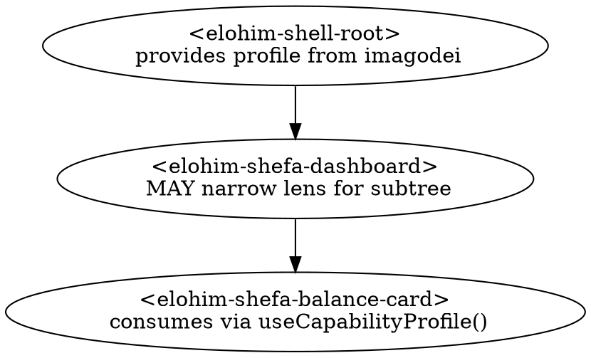

# Capability Profile + Element Contract — Design

**Status:** Draft (brainstorm output)
**Date:** 2026-05-20
**Scope:** Sub-projects #1 (Capability Profile primitive) + #2 (element contract, CEM extension, storybook coverage matrix). Sub-projects #3 (steward-lock attestation), #4 (app-manifest role declaration schema), #5 (theming overrides + EPR feedback gate), #6 (cradle-to-grave lifecycle: tenure, memorial), and #7 (AttentionMinding integration with element renderers) are deferred to follow-on specs.
**Owners:** `app/elohim-elements/*` (Lit substrate), `app/elohim-library/projects/graphos` (storybook composition surface)

---

## 1. Motivation

Every `elohim-element` consumed by an app, a hub, or a doorway projection is read by a person whose **capability and stewardship context is variable**:

- A grandmother and a kernel developer both look at the same shefa balance card.
- A child in a steward relationship and an adult pilot both look at the same content viewer.
- An elohim-on-support session and the human themselves both look at the same imagodei profile.
- A pre-literate child and an adult with acquired aphasia both need symbolic rendering at different disclosure depths.
- A piece of content is read by one pilot when it is freshly reconciled across the hub and by another when only one peer's stale copy is reachable.

A single rendering cannot serve all of these well. The current substrate has no primitive that lets a component say *"this is what I render at standard disclosure for a pilot, this is what I render at debug disclosure for an elohim-support session, this is how I render when the underlying content is stale, and these are the cells I haven't designed yet."*

This spec introduces that primitive — the **Capability Profile** (viewer-side) and the **Content Certainty** (content-side) primitives — and the **element contract** that lets the substrate enforce coverage, a11y, i18n, and OS-preference honor across every cell, surfacing the design matrix to storybook so we can audit "what's done and what still needs to be designed."

This is the repeatable design primitive that all `elohim-elements` observe. It is the substrate underneath the human capability curve.

---

## 2. The Capability Profile

A frozen context object propagated through the DOM and consumed by every element.

```ts
interface CapabilityProfile {
  // Disclosure depth — what the viewer is allowed to see
  lens: Lens;

  // Visual register — orthogonal to disclosure
  theme: Theme;

  // Contrast preference — orthogonal to theme, steward-controllable
  contrast: Contrast;

  // Language and locale — surface language, RTL, locale-formatting
  locale: Locale;

  // Stimulus tier — motion, transitions, micro-interactions (DEFAULT: still)
  stimulus: Stimulus;

  // Textuality — symbolic vs textual communication (see §2.6)
  textuality: Textuality;

  // Attested roles the viewer holds in this context (see §5)
  standings: Standing[];

  // Set by steward / elohim-support / pilot themselves (see §6)
  lock: ProfileLock;

  // For audit and UX — who set this profile, used by shell for banners
  origin: 'pilot' | 'steward' | 'elohim-support';
}

type Lens =
  | 'minimal'   // single value, single action. Welcome-screen tier.
  | 'simple'    // headline numbers + 1 primary action. Default for novice pilots.
  | 'standard'  // full surface as designed for adult pilot. Default lens.
  | 'detail'    // expanded fields, breakdowns, drilldowns visible.
  | 'debug'     // internal state, identifiers, signal traces.
  | 'trace';    // full operational telemetry (DHT actions, libp2p protocols).

type Theme = 'light' | 'dark' | 'auto';

type Contrast = 'normal' | 'high' | 'auto';

// BCP 47 language tag (e.g., 'en', 'en-US', 'es-MX', 'he-IL', 'ar', 'zh-Hans')
// or 'auto' to resolve from navigator.language at render-time.
type Locale = string;

// Stimulus tier — motion, transitions, micro-interactions.
// PROTOCOL DEFAULT IS `still`. Opt-up to gentle/lively in justified contexts.
// Monotonic superset: lively ⊃ gentle ⊃ still.
type Stimulus = 'still' | 'gentle' | 'lively' | 'auto';

// Textuality — symbolic vs textual communication.
// `symbolic` favors icons, images, spatial layout, optional voice readout.
// `textual` is the default for literate adults.
// `auto` resolves from imagodei reading-comprehension attestations + steward lock.
type Textuality = 'symbolic' | 'textual' | 'auto';
```

### 2.1 Lens — what each tier means

The six lenses form a monotonic disclosure ramp. Every higher lens shows a **superset** of what the lens below shows — a `detail` view never hides something visible at `standard`. This guarantees that escalating disclosure never disorients (information appears, never moves).

| Lens | Example: shefa balance card | Audience cue |
|------|----------------------------|--------------|
| `minimal` | "You have enough." (single sentence) | Welcome screen, post-recovery, gentle entry |
| `simple` | "5GB / 15GB available" + one action | Default for kids, grandma, low-tech pilots |
| `standard` | Above + free/used/stewarded breakdown + hub members | Default for adult pilots |
| `detail` | Above + per-device contribution, RS(N,K) policy | Power users, developers, curious learners |
| `debug` | Above + commitment-IDs, attestation hashes, signal timestamps | Self-troubleshooting, deep-preferences power users |
| `trace` | Above + DHT actions, libp2p protocols, full operational telemetry | Elohim drop-in support, postmortem reviews |

### 2.2 Theme — visual register

`light | dark | auto`. The names follow the W3C `prefers-color-scheme` primitive deliberately:

- App-manifest contracts read `theme: 'dark'` without needing to know elohim's brand vocabulary.
- Third-party pillars implementing elements speak a portable, standard contract.
- Brand tokens (Linen, Deep Sky, Indigo Night, Starlight) **bind under** these names in `elohim-core/tokens.scss` — they are bindings, not values of the primitive.
- `auto` resolves to `light` or `dark` at render-time based on `matchMedia('(prefers-color-scheme: dark)')`.

A lock may pin `theme` explicitly (e.g., a pilot with a visual-accessibility need has chosen `dark` and pinned it for stability).

### 2.3 Contrast — orthogonal to theme

`normal | high | auto`. Separate axis from theme because high-contrast is a low-vision accommodation distinct from light/dark preference (a low-vision pilot may want high-contrast *light*, not high-contrast *dark*).

- `auto` resolves from `prefers-contrast` at render-time.
- A steward may pin `contrast: 'high'` for a senior pilot regardless of OS setting — the protocol's pinned value supersedes the OS preference.
- Brand tokens have a `high-contrast-*` variant set in `elohim-core/tokens.scss` that activates when the resolved contrast is `high`. The variant ensures WCAG AAA contrast ratios (≥7:1 for body text, ≥4.5:1 for large text) regardless of theme.

This axis is profile-controllable (steward can pin) and is therefore distinct from the OS-level `forced-colors` mode (which is enforced by the precondition gate — see §8.3).

### 2.4 Locale — surface language

A BCP 47 language tag (`en`, `en-US`, `es-MX`, `he-IL`, `ar`, `zh-Hans`) or `auto` to resolve from `navigator.language` at render-time. The locale axis governs three concerns inside elements:

1. **Translation** — every user-facing string an element renders comes from a translation lookup (`t('shefa.balance.title')`), never a literal. Hardcoded strings fail the i18n gate (§8).
2. **Layout direction** — RTL languages (`he`, `ar`, `fa`, `ur`) mirror layout via CSS logical properties (`margin-inline-start`, not `margin-left`). The shell sets `dir="rtl"` on the document root based on locale; elements use logical properties throughout their styles.
3. **Locale-formatting** — numbers, dates, currency, lists use `Intl.NumberFormat`/`Intl.DateTimeFormat`/`Intl.ListFormat` with the active locale. No hardcoded `en-US` formatting.

**Protocol vocabulary is preserved across locales.** The Hebrew names of the protocol pillars (`elohim`, `qahal`, `shefa`, `lamad`, `imagodei`, `mishpat`, `avodah`) and protocol primitives (`pantry`, `quilt`, `shard`, `RS(N,K)`) are proper nouns of the protocol — they pass through translation unchanged. User-facing prose *around* those terms is translated. The translation system marks these as preserve-as-is and the i18n test gate confirms they appear verbatim in every locale's bundle.

A lock may pin `locale` (e.g., a steward sets a child's interface to `es-MX` and pins it so they don't accidentally land in a language they can't navigate).

### 2.5 Stimulus — motion, transitions, micro-interactions

**The protocol default is `still`.** This is a deliberate inversion of typical web design, which treats motion as the default and reduced-motion as the accommodation. Elohim treats stillness as the default and stimulus as the opt-up.

The reasoning is brand-aligned and capability-aligned simultaneously:

- **Sabbath rhythm.** The brand spec (§1, §9) names *stillness as a feature*. "Screens that have no new information should be still. No ambient animations, no pulsing dots." The Profile encodes this in the type system.
- **First-class e-paper support.** E-paper readers (Kindle, reMarkable, Boox, Daylight, Pebble Steel) have refresh rates of 1–2 fps for full updates. Motion designed for LCD silently breaks on e-paper. Treating `still` as default means e-paper is a first-class persona, not a degraded one.
- **Vestibular and neurological accommodation.** Pilots with motion sickness, vestibular conditions, ADHD, or migraine triggers cannot tolerate the constellation pulse and provision wave at full expression. They are not an edge case — they are protocol citizens with a stewarded relationship to stimulus.
- **Battery and bandwidth on hub-projected surfaces.** Lively motion on a doorway-SSR projection costs network and CPU on the projecting node. Still is cheap; lively is dear.

| Tier | Allowed motion | Use case |
|------|---------------|----------|
| `still` | No motion. Instant state changes. No hover effects beyond outline/focus. No transitions on theme change. | **Default.** E-paper readers. Vestibular-sensitive pilots. Battery-conscious sessions. Sabbath surfaces. |
| `gentle` | Crossfade transitions (≤300ms). Initial constellation line-drawing on first mount. No looping animations. No motion on hover. | Adult pilot who has opted in; surfaces where a slow appear-once animation aids comprehension. |
| `lively` | Full brand-spec motion language. Provision pulse. Constellation tracing on every re-render. Hover micro-interactions. | Celebratory contexts (a provision being completed). Stories. Explanations. Opt-in by the pilot. Never default. |
| `auto` | Resolves at render-time from OS preferences (see §8.3) with `still` as the safe floor. | When unspecified. |

#### Default profile

```ts
const DEFAULT_PROFILE: CapabilityProfile = {
  lens: 'standard',
  theme: 'auto',
  contrast: 'auto',
  locale: 'auto',
  stimulus: 'still',           // Sabbath in the type system
  textuality: 'textual',       // adult-literate default; steward may override
  standings: [],
  lock: { kind: 'pilot' },
  origin: 'pilot',
};
```

#### OS hard-floors (composes with §8.3)

Stimulus from the Profile composes with OS preferences as a **min** operation. The OS may force stimulus lower than the profile requests; the OS cannot force stimulus higher.

```
effectiveStimulus = min(profile.stimulus, osCeiling)

where osCeiling is `still` if EITHER
  - prefers-reduced-motion: reduce, OR
  - update: slow (e-paper detection)
otherwise `lively`.
```

This means an e-paper reader always sees `still`, regardless of what the profile says. A pilot who has set `prefers-reduced-motion: reduce` in their OS always sees `still`, even if a surface optimistically requests `lively`.

#### Monotonic superset

`lively ⊃ gentle ⊃ still`. An element designed for `lively` automatically satisfies `gentle` and `still` (it knows how to render without motion when stimulus is lower). An element designed only for `still` does NOT automatically satisfy `gentle` (it has no motion to gracefully add). The contract lets an element claim its maximum supported stimulus; lower tiers are inferred.

A lock may pin or cap stimulus:

- `pinnedStimulus: 'still'` — never animate for this pilot.
- `maxStimulus: 'gentle'` — toggle UI offers still and gentle; lively is hidden.

### 2.6 Textuality — symbolic vs textual communication

`symbolic | textual | auto`. This axis is **orthogonal to lens**, not a tier below it. A pre-literate child and an adult who lost reading via stroke both need symbolic rendering — but the adult may need it at `standard` disclosure depth, while the child needs it at `minimal`. Lens and textuality are independent.

| Tier | Rendering posture | Audience |
|------|-------------------|----------|
| `symbolic` | Icons, photographs, spatial layout, color-coded states, optional voice readout. Text is supplementary, not primary. Numbers shown as fills/proportions, not digits where possible. | Pre-literate children. Adults with aphasia, dementia, or acquired reading loss. Pilots whose primary language is signed (BSL, ASL) — text is L2 for them. |
| `textual` | Default. Text is the primary information carrier; icons supplement. | Literate adults. |
| `auto` | Resolves from imagodei reading-comprehension attestations + locale (some locales lack robust translations for certain content and benefit from symbolic supplementation) + steward lock. | When unspecified. |

#### Why this is its own axis, not a lens tier

If textuality were a lens tier below `minimal`, an aphasic adult who needs to discuss complex stewardship decisions would be forced into pre-literate disclosure depth — patronizing and useless. By making textuality orthogonal, we get the full matrix:

- `(standard, symbolic)` — adult-grade decision content rendered symbolically
- `(minimal, textual)` — single-sentence text for a literate adult easing in
- `(simple, symbolic)` — kid-friendly icons with welcome content

#### Element contract implication

Elements declare which textuality modes they support (see §7). Not every element needs symbolic — `<elohim-button>` is intrinsically symbolic (icon + optional label) and trivially supports both. A `<elohim-lamad-content-viewer>` rendering Markdown text has work to do to support `symbolic` (it needs a glossary of concept-to-symbol mappings, voice-readout glue, and a different layout).

#### Lock

A lock may pin `textuality`. The most common case is a steward setting `symbolic` for a young child; a pilot may toggle to `textual` once they begin reading. Acquired-aphasia handovers (e.g., post-stroke recovery) typically pin via imagodei attestation rather than profile lock — the change is durable.

#### Cross-cutting requirement

When `textuality === 'symbolic'`, the i18n gate's "no hardcoded strings" rule extends: symbolic representations (icons, color associations, layout meanings) must also pass an inventory check. Color-coding cannot be the sole carrier of meaning (WCAG 1.4.1). Icons must come with text labels (delivered via aria-label even when visually hidden) so the symbolic surface remains screen-reader-readable.

---

## 3. Propagation

The profile is provided once at the app shell and narrowed (never escalated) by intermediate containers.



### 3.1 Mechanism — Lit `@lit/context`

```ts
// elohim-core/src/capability-profile.ts
import { createContext } from '@lit/context';

export const capabilityProfileContext = createContext<CapabilityProfile>(
  'elohim-capability-profile'
);
```

Provider (in shell):

```ts
@provide({ context: capabilityProfileContext })
@state()
profile: CapabilityProfile = deriveProfileFromImagodei(this.identity);
```

Consumer (in every element that needs it):

```ts
@consume({ context: capabilityProfileContext, subscribe: true })
@state()
profile!: CapabilityProfile;
```

For convenience, `elohim-core` exports a `CapabilityAwareElement` mixin that wires the consumer and re-renders on profile change. Elements opting in extend `CapabilityAwareElement(LitElement)` instead of `LitElement` directly.

### 3.2 Narrowing rules

A container may narrow lens **downward** (e.g., a "kid-safe content browser" on an adult's session forces `lens = 'simple'` for its subtree). A container may **not** escalate beyond what the root permits — narrowing is a one-way ratchet within the subtree.

If a container attempts to escalate, the consumer ignores the override and reads the nearest broader allowed lens. This is enforced by the `useCapabilityProfile` consumer wrapper, not by trust — narrowing-only is a load-bearing invariant.

---

## 4. Content Certainty — the companion observable

The Capability Profile describes the **viewer**. Content Certainty describes the **content being rendered**. They are two distinct primitives that elements observe together to decide what to show and how.

In a P2P / EPR / CID world, "data is loaded" does NOT mean "data is true." Content has freshness, contested-ness, reach-gated visibility, and reconciliation state. Elements need to express *epistemic state* — what is known vs. what is partial vs. what is contested — not just data content.

### 4.1 Shape

```ts
interface ContentCertainty {
  // Reconciliation state — what the protocol knows about the content's truth
  state: CertaintyState;

  // Optional richness — populated when known, omitted when not
  freshness?: number;           // ms since last reconciliation against any peer
  attestationCount?: number;    // how many witnesses have signed this content
  reachDistance?: number;       // hops from viewer to nearest steward of this content
  contestedBy?: string[];       // attestation IDs disagreeing with the canonical view
  sourcePeers?: string[];       // which peers have served this content to us
}

type CertaintyState =
  | 'canonical'   // fresh, fully reconciled, multiple confirming attestations
  | 'partial'     // syncing in progress; some peers haven't responded yet
  | 'stale'       // last reconciled N minutes ago; may be out of date
  | 'contested'   // multiple attestations disagree; no canonical view exists
  | 'unreachable' // no peer is currently serving this content; local cache only
  | 'unknown';    // freshly opened, not yet probed
```

### 4.2 Propagation

ContentCertainty propagates differently from the Capability Profile because **certainty is per-content, not per-surface**. Two patterns:

1. **Per-content prop** (default) — the parent passes certainty as a property to the rendering element:
   ```html
   <elohim-shefa-balance-card .certainty=${this.balanceCertainty} .balance=${this.balance}>
   </elohim-shefa-balance-card>
   ```
2. **Context-provided** (uniform-certainty surfaces) — for panels of content all freshly synced from the same source, a container may provide ContentCertainty via `@lit/context` for its subtree to inherit.

Most elements use pattern 1. Pattern 2 is appropriate for dashboards or feeds where every piece of content shares a single reconciliation moment.

### 4.3 Rendering at each lens

Elements express certainty at the lens they're rendering at:

| Lens | Certainty rendering example (shefa balance card) |
|------|---------------------------------------------------|
| `minimal` | No certainty indicator. If `state === 'unreachable'`, show "We can't reach this right now." instead of the value. |
| `simple` | Quiet dot indicator: green for canonical, amber for partial/stale, terracotta for contested/unreachable. |
| `standard` | Above + tiny relative-time text ("synced 2m ago"). |
| `detail` | Above + reach-distance + attestation count + "synced from N peers." |
| `debug` | Above + source-peer IDs + last-probe timestamps. |
| `trace` | Above + full attestation chain + libp2p protocol used to fetch. |

### 4.4 Element observation declaration

Elements that read ContentCertainty declare so in their contract (see §7). Elements that *don't* read it claim `contentCertainty: 'not-observed'` — this is honest. A `<elohim-button>` is trivially not-observed; a content-viewing card MUST observe certainty or fail review.

### 4.5 Default

When ContentCertainty is absent (no prop, no context), elements treat the content as if `state: 'unknown'`. Rendering at `unknown` MUST NOT mislead — a card without provided certainty either shows a quiet indicator that says "we don't know" or renders nothing certainty-related at all. Elements MUST NOT render the visual indicators of `canonical` when they have no evidence for it.

### 4.6 What this primitive deliberately does NOT do

- **It does not gate access.** Reach-gating is a separate primitive (the reach-earning gate at authoring time; see graph-native-projection substrate spec). ContentCertainty describes *what we have*, not *what the viewer is permitted to see*.
- **It does not filter values-aligned attention.** AttentionMinding is a separate primitive (see §8.4 cross-reference and sub-project #7). ContentCertainty is epistemic; AttentionMinding is values-derived.
- **It does not impose policy.** Whether `stale` content should be auto-refreshed, whether `contested` content should be hidden, whether `unreachable` content should trigger a sync attempt — these are application-level policies, not properties of the primitive.

---

## 5. Standing — tiered enforcement

A **Standing** is an attested role the viewer holds relative to this surface's content/context. The profile carries a list because a viewer may hold multiple simultaneously (`['pilot', 'contributor']`).

### 5.1 Protocol-core Standings (HARD-enforced)

Declared by the protocol; every conformant runtime understands them.

| Standing | Meaning |
|----------|---------|
| `pilot` | The human themselves, viewing their own surface |
| `steward` | A delegated guardian (recovery agent, parent, legal stewardee) |
| `elohim-support` | An elohim-on-support session, time-bounded, attested by doorway |
| `contributor` | The viewer authored some part of this content |
| `witness` | The viewer has attested to this content (signed, endorsed) |
| `commitment-holder` | The viewer holds a stewarded REA commitment relevant to this content |

**Enforcement:** if an element declares a protocol Standing as required and the profile doesn't carry it, the element **refuses to render** — it emits a `<elohim-standing-refused>` slot with the required Standing name. The surrounding chrome (provided by the shell) decides what to render in its place.

### 5.2 App-declared Standings (SOFT-enforced)

Apps may extend the role surface via their manifest:

```jsonc
// lamad app manifest (illustrative — schema is sub-project #4)
{
  "appStandings": {
    "lamad:reviewer":   "Has reviewed this learning path's content",
    "lamad:mentor":     "Mentor relationship with the learner viewing this path"
  }
}
```

**Enforcement:** if an element declares an app Standing as required and the profile doesn't carry it, the element renders a **placeholder slot**:

```html
<elohim-standing-placeholder for="lamad:reviewer">
  This surface needs a reviewer to be shown. Ask your hub admin to assign one.
</elohim-standing-placeholder>
```

The surrounding chrome continues to render. App Standings degrade gracefully because they are not load-bearing for the protocol — only for the app.

### 5.3 Standing logic in the contract

An element declares which Standings it requires. The contract uses simple boolean composition:

- `["pilot"]` — must hold pilot
- `["pilot | steward"]` — pilot OR steward (typical for a personal surface a guardian may also view)
- `["pilot", "contributor"]` — pilot AND contributor

The same shape applies to optional Standings, which gate *additional* features within the surface (e.g., "an editor button appears if you also have `contributor` Standing").

---

## 6. Lock semantics

The lock is a property of the **active profile**, never of the consuming element. Elements only see the resulting allowed lens range; they never see the lock directly.

```ts
interface ProfileLock {
  kind: 'pilot' | 'steward' | 'elohim-support';

  // Lens enforcement (mutually exclusive — one or the other, not both)
  pinnedLens?: Lens;     // exact lens, no toggle UI rendered
  maxLens?: Lens;        // upper bound, toggle UI shows only allowed lenses ≤ max

  // Theme enforcement (e.g., visual-accessibility pin)
  pinnedTheme?: Theme;

  // Contrast enforcement (e.g., steward pins high-contrast for low-vision pilot)
  pinnedContrast?: Contrast;

  // Locale enforcement (e.g., steward pins a child to a specific language)
  pinnedLocale?: Locale;

  // Stimulus enforcement (mutually exclusive — one or the other)
  pinnedStimulus?: Stimulus;   // exact stimulus, no toggle UI
  maxStimulus?: Stimulus;      // upper bound, toggle shows allowed tiers only

  // Textuality enforcement (e.g., steward pins symbolic for pre-literate child)
  pinnedTextuality?: Textuality;

  // For time-bounded elohim-support sessions
  expiresAt?: number;    // ms epoch, profile reverts to prior state after
}
```

### 6.1 Lock cases

| Pilot situation | Lock |
|----|----|
| Adult, unstewarded | `{ kind: 'pilot' }` — full lens range, debug/trace buried in deep preferences |
| Adult with stated visual-a11y preference | `{ kind: 'pilot', pinnedTheme: 'dark' }` |
| Adult who reads only Spanish | `{ kind: 'pilot', pinnedLocale: 'es-MX' }` |
| Pre-literate child with parent-steward | `{ kind: 'steward', maxLens: 'simple', pinnedTextuality: 'symbolic', pinnedLocale: 'es-MX' }` |
| Child / IDD / legal-stewardee / senior with a guardian | `{ kind: 'steward', maxLens: 'standard', pinnedLocale: 'es-MX' }` — bounded disclosure + pinned language |
| Adult with acquired aphasia (durable, via imagodei attestation) | `{ kind: 'pilot', pinnedTextuality: 'symbolic' }` — symbolic rendering at full standard depth |
| Elohim-support drop-in for technical help | `{ kind: 'elohim-support', expiresAt: now + 30min }` — full lens range, session expires |

### 6.2 Toggle UI behavior

The lens-toggle UI (rendered by `<elohim-shell-lens-switch>`, not by individual elements) reads the lock:

- `pinnedLens` present → no toggle rendered
- `maxLens` present → toggle renders only lenses up to and including `maxLens`
- neither present → toggle renders all six lenses (with `debug`/`trace` collapsed under a "for interpretability" preference panel, not in the casual ramp)

### 6.3 Banners

The shell renders a stewardship banner when `origin !== 'pilot'`:

- `origin: 'steward'` → "Your steward has set this view"
- `origin: 'elohim-support'` → "Support session active · expires in 14 min"

Consuming elements never render these banners; they only observe the lens they're allowed to render at.

---

## 7. Element contract — CEM extension

Every element extends the custom-elements-manifest with a `capabilityContract` block. The contract is the single source of truth for what the element implements and what remains to design.

### 7.1 Shape

```jsonc
{
  "tag": "elohim-shefa-balance-card",
  "capabilityContract": {
    // Precondition gates (§8) — any "failing" blocks ALL cells
    // These three fields are owned by the test runner; cannot be hand-edited.
    "a11y": "passing",
    "i18n": "passing",
    "uaPrefs": "passing",

    // Claimed cells (visual / capability axes)
    "maxLens": "detail",                  // monotonic: implies minimal/simple/standard
    "themes": ["light", "dark"],          // "auto" not listed; resolves to light|dark
    "contrast": ["normal", "high"],       // explicit high-contrast support claimed
    "locales": ["en", "es", "he"],        // including he as the RTL canary
    "maxStimulus": "gentle",              // monotonic: implies "still" too (§2.5)
    "textuality": ["textual", "symbolic"],// both modes claimed
    "standings": {
      "required": ["pilot | steward"],
      "optional": ["contributor"]
    },
    "appExtensions": [],                  // app-declared Standings used, if any

    // Content-state coverage — orthogonal to visual cells
    "contentCertainty": "observed",       // see §4.4
    "states": {
      "empty": "designed",                // first-time-here, no data yet
      "loading": "designed",              // partial sync in progress
      "error": "designed",                // network failure, unreachable peer
      "stale": "designed",                // cached, last reconciled N min ago
      "contested": "not-yet",             // honest admission — not designed
      "offline": "designed",              // device offline, local-first
      "unauthorized": "n/a"               // Standing-gated; refuse is the renderer
    }
  }
}
```

**Monotonic axes (lens, stimulus) use `max*` form, not enumeration.** Claiming `maxStimulus: "gentle"` means the element supports `still` and `gentle`; claiming `maxLens: "detail"` means the element supports `minimal` through `detail`. Lower tiers are automatically inferred. Non-monotonic axes (theme, contrast, locale, stimulus, textuality, standing) must be enumerated.

### 7.2 Element state-category claims (orthogonal to visual cells)

The `states` block is independent of the visual axes. An element may design beautifully across all `(lens × theme × contrast × locale × stimulus × textuality × standing)` cells but still fail at rendering `error` or `contested` — at which point its row in the coverage matrix shows the gap honestly.

State categories (extensible per element; below is the protocol-canonical set):

| State | Meaning | Designed example |
|-------|---------|------------------|
| `empty` | First-time-here; no data exists yet | "Your constellation is still empty — invite a neighbor to begin." |
| `loading` | Sync in progress; partial data | Quiet partial render with shimmer or dots |
| `error` | Network failure, unreachable peer, CID missing | "We can't reach this right now. Last seen 2h ago." |
| `stale` | Cached; last reconciled long ago | Element renders content with a quiet stale indicator |
| `contested` | Multiple attestations disagree | Side-by-side view of the conflicting versions; pilot chooses how to resolve |
| `offline` | Device is offline; local-first rendering | Same as canonical but with offline banner; queued actions visible |
| `unauthorized` | Standing not held; refused | Handled by `<elohim-standing-refused>`; element marks as `n/a` for itself |

Each state declared as `designed` MUST have a corresponding test. `not-yet` is an honest admission; the coverage matrix surfaces it. `n/a` means the state doesn't apply to this element (e.g., a button has no `contested` state).

### 7.3 Authoring

The author declares the contract via JSDoc tags on the element class, which the CEM analyzer picks up:

```ts
/**
 * @element elohim-shefa-balance-card
 *
 * @capabilityMaxLens detail                          // monotonic — implies minimal/simple/standard
 * @capabilityThemes light, dark
 * @capabilityContrast normal, high
 * @capabilityLocales en, es, he
 * @capabilityMaxStimulus gentle                      // monotonic — implies still
 * @capabilityTextuality textual, symbolic
 * @capabilityRequiredStandings pilot | steward
 * @capabilityOptionalStandings contributor
 *
 * @capabilityContentCertainty observed
 * @capabilityStates empty:designed, loading:designed, error:designed, stale:designed, contested:not-yet, offline:designed
 */
export class ElohimShefaBalanceCard extends CapabilityAwareElement(LitElement) {
  // ...
}
```

The `elements:codegen` script reads these tags into the CEM `capabilityContract` block. The author may not write `a11y`, `i18n`, or `uaPrefs` themselves — those fields are owned by the test runner.

### 7.4 Test coverage requirement

Every claimed visual cell `(lens × theme × contrast × locale × stimulus × textuality × standing-combination)` AND every state declared `designed` MUST have at least one matching test. The codegen script refuses to write the manifest if a claimed cell or state has no test that exercises it. Failure mode:

```
elements:codegen — coverage gap
  elohim-shefa-balance-card claims state=error but no spec exercises it.
  Add a test or remove the claim.
```

This prevents drift between "designed" and "tested."

---

## 8. Precondition gates — preconditions on all cells

**Three gates are preconditions for ALL cells, not cells themselves.** If any one fails, the entire element is treated as having zero designed cells, regardless of other claims:

1. **A11y** — keyboard, screen-reader, axe-core (§8.1)
2. **I18n** — translation, RTL, locale-formatting (§8.2)
3. **User-agent preferences** — reduced-motion, reduced-transparency, forced-colors, reduced-data, pointer/hover, photosensitive-safe (§8.3)

Each gate has a corresponding field in the CEM contract:

```jsonc
"capabilityContract": {
  "a11y": "passing" | "failing",
  "i18n": "passing" | "failing",
  "uaPrefs": "passing" | "failing",
  // ... cells follow
}
```

Any `failing` value blocks ALL cells. The contract is: a poorly-constructed element has no designed cells until reworked. Partial-pass is not an option.

### 8.1 A11y gate

Every `*.spec.ts` MUST include:

1. **Keyboard navigation** — tab into the element, escape out, activate, navigate slot contents via arrow keys where applicable. Focus visible at every step.
2. **Screen-reader semantics** — appropriate ARIA roles and labels; state changes announced via live regions where appropriate; semantic HTML preferred over ARIA where it suffices.
3. **axe-core scan** — zero `serious` or `critical` violations, run against every (lens × theme × contrast × textuality) variant the element claims.

### 8.2 I18n gate

Every element MUST satisfy:

1. **No hardcoded user-facing strings.** Every visible string and every `aria-label`/`aria-description`/`title` comes from a translation lookup (`t('key')`). A static-analysis pass (regex in the test runner) flags any string literal in template content or aria-* attributes.
2. **Protocol vocabulary preserved.** The translation system marks `elohim`, `qahal`, `shefa`, `lamad`, `imagodei`, `mishpat`, `avodah`, `pantry`, `quilt`, `shard`, `RS` as preserve-as-is. The test confirms these appear verbatim across all locale bundles.
3. **RTL layout** — all positional CSS uses logical properties (`margin-inline-*`, `padding-inline-*`, `inset-inline-*`, `border-inline-*`) instead of physical (`margin-left`, etc.). A stylelint rule enforces this. A visual-regression test renders the element in an RTL locale (`he-IL`) and confirms layout mirrors correctly.
4. **Locale-formatting** — numbers, dates, currency, lists use `Intl.*` formatters with the active locale. A lint rule flags `toLocaleString()` calls without an explicit locale argument.
5. **Symbolic-mode inventory check** — when the element claims `textuality: symbolic`, color-coding cannot be the sole carrier of meaning (WCAG 1.4.1); icons must carry text alternatives via `aria-label`; the symbolic representation must remain screen-reader-readable.

### 8.3 User-agent preferences gate

Every element MUST honor these CSS media queries / DOM APIs. The OS owns these preferences; the protocol cannot override them. Several of them compose with profile axes as **hard floors** — the OS may force a value below what the profile requests, but the OS can never force a value above.

1. **`prefers-reduced-motion`** — composes with the `stimulus` Profile axis (§2.5). When `prefers-reduced-motion: reduce` is active, `effectiveStimulus = 'still'` regardless of profile request. Elements that claim `maxStimulus: gentle` or higher MUST render correctly at `still` (their motion code paths are gated by the resolved stimulus, not by media query alone).
2. **`update: slow`** — e-paper detection. Also forces `effectiveStimulus = 'still'`. Additionally, elements should avoid micro-redraws (hover micro-interactions, focus pulses) when `update: slow` because partial e-paper refreshes ghost. A test renders the element with `update: slow` and confirms no transition/animation properties resolve to active and no hover micro-interactions trigger DOM changes.
3. **`prefers-reduced-transparency`** — any rgba/opacity-based stroke or fill has an opaque fallback inside `@media (prefers-reduced-transparency: reduce)`. Constellation lines at 60% opacity become 100% opacity. A test confirms this.
4. **`forced-colors`** — within `@media (forced-colors: active)`, the element uses CSS system colors (`Canvas`, `CanvasText`, `LinkText`, `ButtonFace`, `ButtonText`, `Highlight`, `HighlightText`) instead of brand tokens. A test renders the element with `forced-colors: active` and confirms no brand colors leak through.
5. **`prefers-reduced-data`** — media-heavy elements (e.g., illustrative imagery, video preview) provide a low-data variant. A test toggles the query and confirms the element loads only essential resources.
6. **`pointer`/`hover`** — minimum touch-target 44×44 px when `pointer: coarse`. Hover-only affordances (tooltips, dropdown triggers) have an equivalent activated-via-tap or focus path. A test runs the element in a coarse-pointer context and confirms targets meet the minimum and all hover affordances have non-hover equivalents.
7. **Photosensitive epilepsy safety (WCAG 2.3).** No CSS animation or programmatic re-render produces flashes >3 Hz, no high-contrast strobing patterns, no rapid full-screen luminance changes. A test runs the element through every claimed stimulus tier and verifies frame-by-frame that no luminance delta exceeds the WCAG flash-threshold formula within a 1-second window. This is implicit in `stimulus: still` but explicit here because even `gentle` and `lively` MUST NOT cross the photosensitive threshold — there is no tier of stimulus that permits seizure-triggering motion.

#### Why stillness as default beats stillness as accommodation

If `prefers-reduced-motion` were the only mechanism, animation would still be the "real" design and reduced-motion a fallback the author *might* implement. By making `still` the protocol default and letting elements *opt up* to gentle/lively (and have the OS still cap them), the protocol guarantees:

- Every element has a still rendering, because it has to start there.
- Adding motion is an explicit design decision that has to justify itself.
- E-paper and motion-sensitive pilots get the full design, not a stripped one.

### 8.4 Sibling primitives — out-of-scope filters that elements may layer over the contract

Two protocol primitives operate at different layers from this spec and elements may be wired to observe them. They are NOT part of the element contract because they are not capability/renderer concerns:

- **Reach-earning gate** (epistemic; established at content authoring time). Filters *what content the viewer is permitted to see at all*. See `2026-05-01-light-up-the-graph-design.md` and `2026-05-16-graph-native-projection-substrate-design.md`. The element doesn't gate this; storage does.
- **AttentionMinding** (values-derived; bounded and expirable by design). An expressive filter that lets a pilot adopt a values-first posture — "no death-related provisions for 30 days," "no news during family dinner," "no work content this weekend." It is NOT the primary epistemic filter (reach is); it is a values filter, often time-bounded. Element design respects device defaults (this spec's §8.3) AND pilot-set AttentionMinding posture (sub-project #7) — but the renderer treats AttentionMinding as a filter on what content reaches the element, not as a property of the element itself.

Specific overlap to note: **epilepsy / photosensitivity** appears in BOTH §8.3 (where it's enforced by the renderer respecting OS preferences and the WCAG 2.3 rule above) AND in AttentionMinding (where a pilot may declare a values-first stance against flashing content for reasons that go beyond clinical photosensitivity). The renderer enforces the floor; AttentionMinding adds the values layer.

Integrating AttentionMinding into element observation is sub-project #7. For this spec, elements honor device defaults; the AttentionMinding layer wraps elements rather than penetrating them.

### 8.5 Why these are gates, not cells

If any of these were cells, an element could ship with "designed for standard-light-pilot but not yet a11y-compliant" — which is exactly the failure mode the user explicitly rejected. Treating them as preconditions means a non-compliant element is, definitionally, not yet designed.

These are also distinct from profile axes (lens, theme, contrast, locale, stimulus, textuality, standings) because they are not steward-controllable. The OS / user agent / WCAG conformance owns them; the protocol enforces honor, never overrides.

---

## 9. Storybook coverage matrix (sub-project #2 surface)

`app/elohim-library/projects/graphos` gets a new auto-generated story under `__substrate__/capability-coverage`:

### 9.1 Layout

- **Rows:** every registered element × every claimed `(lens, theme, contrast, locale, stimulus, textuality)` combination
- **Columns:** protocol-core Standings + app-declared Standings (grouped under their pillar)
- **State sidebar:** alongside each element row, a small grid showing state-category claims (empty/loading/error/stale/contested/offline) — green ✓ where designed, dotted ⬚ for not-yet, dash — for n/a.
- **Cells:**
  - ✓ — designed and tested
  - ⬚ — not yet designed (no claim, no test)
  - 🔴 — any precondition gate failing (a11y / i18n / uaPrefs); entire row red regardless of other claims
- **Header summary:** "Coverage: 38 / 1440 visual cells + 67 / 84 state-cells across 12 components · 2 elements failing a11y · 1 failing i18n · 8 cells assigned to current sprint"
- **Pivot toggles:** the matrix is high-dimensional. The default view pivots on (lens × standing) with theme/contrast/locale/stimulus/textuality fixed at "default" filters; pivot dropdowns let the viewer flip the axis pair.

### 9.2 Data source

The story reads exclusively from the merged CEM (the `custom-elements.json` produced by `elements:codegen` across all packages). There is no separate registry. Drift is impossible because there is no second source.

### 9.3 Sprint linkage

Cells may carry a `claimed-for-sprint: <sprint-slug>` annotation in a side-file (`graphos/coverage-sprint-claims.json`). This lets sprint planning name which cells the sprint promises to deliver, and the coverage matrix highlights them. This file is the only mutable surface in the matrix — everything else is derived from CEM + test runs.

---

## 10. What this spec deliberately defers

| Concern | Deferred to |
|---------|-------------|
| Where the steward-lock attestation lives (imagodei DHT entry vs agent-scoped storage), revocation, recovery integration | Sub-project #3 |
| Full app-manifest schema for `appStandings` (required/optional, descriptions, defaults, placeholder copy) | Sub-project #4 |
| MySpace-style theming overrides + custom CSS pre-pend per page + EPR reach-downgrade feedback gate | Sub-project #5 |
| **Cradle-to-grave lifecycle:** `tenure` (new/established), `mode` (living/memorial), graduated steward→pilot handover ceremony | **Sub-project #6** — intersects imagodei attestations + recovery + estate planning |
| **AttentionMinding integration with element renderers** — how a pilot's values-bounded posture composes with this contract; cross-references with reach-gating | **Sub-project #7** — intersects with reach gate, EPR composition, and posture-as-filter substrate |

The primitive in this spec is independently shippable. The deferred sub-projects build on it without modifying its shape.

---

## 11. Decomposition into implementation milestones

Suggested order (the implementation plan, written by `writing-plans`, will refine):

1. **M1** — `CapabilityProfile` type + `ContentCertainty` type + `@lit/context` provider/consumer + `CapabilityAwareElement` mixin in `elohim-core`. No element consumers yet; the mixin compiles and the context resolves to a sensible default.
2. **M2** — Test harness for the three precondition gates:
   - **A11y harness** — axe-core scan + keyboard-nav helpers in `elohim-core/testing/`.
   - **I18n harness** — translation-key linter, RTL-rendering helper (loads `he-IL` and screenshots), locale-formatter guard rule, symbolic-mode inventory check.
   - **UA-prefs harness** — helpers that toggle `prefers-reduced-motion`, `update: slow` (e-paper sim), `prefers-reduced-transparency`, `forced-colors`, `prefers-reduced-data`, `pointer: coarse`, and a photosensitive-flash-threshold analyzer in web-test-runner.
3. **M3** — `<elohim-button>` migrated to declare a capability contract via JSDoc tags. Codegen reads them into CEM. Contract claims (`maxLens: standard`, themes: light/dark, contrast: normal/high, locales: en, `maxStimulus: still`, `textuality: ["textual", "symbolic"]`, `contentCertainty: not-observed`, `states.empty/loading/error/offline: n/a`) plus all three gates passing. Button is intentionally still-only and certainty-not-observed.
4. **M4** — Storybook coverage matrix story in graphos, reading CEM. With only one element, the matrix shows a small canary view; the read pipeline is validated.
5. **M5** — Second element (`<elohim-card>` or a shefa balance card) added with a wider contract including `he` locale, `high` contrast, `symbolic` textuality, `contentCertainty: observed`, and the full state-category block. Matrix grows; coverage gaps become visible.
6. **M6** — Lock semantics wired through the shell: lens-toggle UI reads `maxLens`/`pinnedLens`, theme/contrast/locale/stimulus/textuality switchers respect their pins, banner for `origin !== 'pilot'`. Stimulus toggle defaults to `still` regardless of profile (Sabbath default surfaces visibly).
7. **M7** — Codegen enforcement: refuse to emit CEM if any claimed cell or designed state has no test, OR if any gate is `failing`.

All three precondition gates (a11y / i18n / uaPrefs including photosensitive-flash) run from M3 onward and never relax.

---

## 12. Glossary

| Term | Meaning |
|------|---------|
| **Capability Profile** | The `{ lens, theme, contrast, locale, stimulus, textuality, standings, lock, origin }` context object propagated through the DOM — describes the **viewer** |
| **Content Certainty** | The `{ state, freshness, attestationCount, reachDistance, contestedBy, sourcePeers }` observable — describes the **content being rendered** |
| **Lens** | Disclosure tier: minimal · simple · standard · detail · debug · trace (monotonic — superset upward) |
| **Theme** | Visual register: light · dark · auto (W3C `prefers-color-scheme`; brand tokens bind underneath) |
| **Contrast** | Contrast preference: normal · high · auto (W3C `prefers-contrast`; steward-controllable) |
| **Locale** | BCP 47 language tag + RTL/LTR direction + locale formatting |
| **Stimulus** | Motion tier: still · gentle · lively · auto (monotonic — superset upward). **Default: still.** Composes with OS `prefers-reduced-motion` and `update: slow` as hard floors. Photosensitive-flash safety is a hard cap on every tier. |
| **Textuality** | Symbolic · textual · auto. Orthogonal to lens (a pre-literate child and an aphasic adult need symbolic at different lenses). |
| **Standing** | An attested role the viewer holds in this context (pilot, steward, contributor, …) |
| **Lock** | Steward / elohim-support / pilot constraint on lens, theme, contrast, locale, stimulus, textuality |
| **Element contract** | The CEM-declared `capabilityContract` block describing which cells AND which states an element implements |
| **Cell** | A specific `(lens × theme × contrast × locale × stimulus × textuality × standing-combination)` tuple an element claims |
| **State** | A non-visual claim on the contract: empty / loading / error / stale / contested / offline / unauthorized |
| **Monotonic axis** | An axis where higher tiers strictly contain lower (lens, stimulus) — claimed via `max*` rather than enumeration |
| **Precondition gate** | A whole-element pass/fail (a11y / i18n / uaPrefs) — failing any one blocks all cells |
| **Coverage matrix** | The storybook view that renders cells across all elements; the audit surface |
| **Sibling primitives** | Reach-earning (epistemic gate, separate spec); AttentionMinding (values-bounded posture filter, sub-project #7). Not part of the element contract. |

---

## 13. Open questions for review

- **Should `CapabilityAwareElement` be the default** for all new elements, or only for those that need the profile? Recommendation: opt-in (extends `CapabilityAwareElement(LitElement)`), so primitives that genuinely don't depend on the profile (e.g., `<elohim-icon>`) skip the consumer overhead.
- **Should the storybook matrix sort by pillar, by coverage %, or by sprint claim?** Recommendation: tabs for each; default to coverage % ascending so the most-incomplete elements surface first.
- **Should `appExtensions` Standings be namespaced by pillar in the CEM contract?** Recommendation: yes (`lamad:reviewer`), to keep app-declared Standings legible and prevent collisions when multiple apps coexist.
- **Should ContentCertainty have a `confidence` numeric field?** Recommendation: no for this spec — `state` is categorical and easier to reason about. Numeric confidence can be added later if a use case demands it.
- **Should `contested` state require pilot-mediated resolution or auto-pick a canonical view?** Recommendation: pilot-mediated for any content of consequence (REA commitments, identity attestations, governance). Auto-pick only for ephemeral content (presence, transient signals). This is an application-policy decision, not a primitive decision; spec leaves it open.
